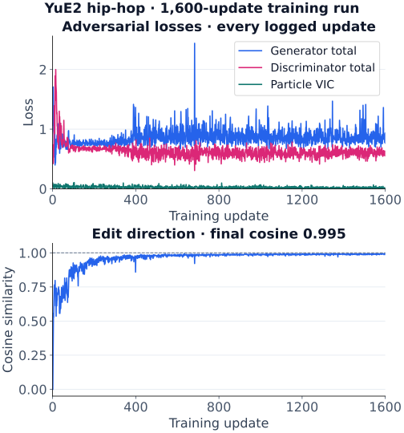
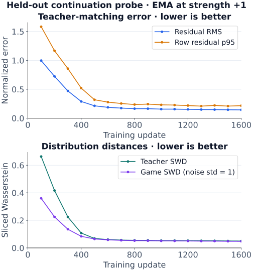

# sliders-conceptmod

**Shared algorithm and research core for model-specific slider releases.**
The installable [concept-slider-core](packages/concept-slider-core) package now
powers [Anima Concept Sliders](https://github.com/mikkel/anima-concept-sliders),
including native particles, training primitives, ComfyUI and LoRA fitting.
See the [shared-core architecture](docs/shared-core.md) and
[Candlelit / Moonlit samples and weights](https://huggingface.co/ntc-ai/anima-concept-sliders).
YuE2 and Music 3 retain their existing implementations; future integrations can
pin the same core after their own compatibility checks.

**Learn a musical control, then turn it with a slider.** Keep the caption,
lyrics and seed fixed while changing voice or genre with a numeric strength.

**YuE2's routed-particle method is our preferred formulation.** It learns the
edit through a paired-error adversarial game, with a regularized particle cloud
inside the adapter, drawing on [ParticleGAN](https://github.com/255BITS/ParticleGAN).
This is the cleanest expression of the approach in this
fork: adversarial teacher matching without output MSE, feature matching, lyric
hold or ending supervision. The [math below](#yue2-the-lead-formulation)
spells out both the game and its regularizers.

This is a substantially divergent fork of
[Concept Sliders](https://github.com/rohitgandikota/sliders), with its own music
objectives, adapter architectures and listening tools. It also includes
**MiniMax Music 3**, other language-model experiments, modern image/video
backends and the inherited diffusion-slider code.

[Listen](#listen-and-download) · [YuE2 math](#yue2-the-lead-formulation)
· [Training evidence](#training-evidence) · [Get started](#getting-started) · [Models](#models-and-status)
· [Other formulations](#other-training-formulations) · [Evaluation](#evaluation)
· [Repository map](#repository-map)

## Listen and download

| Project | Hugging Face links |
|---|---|
| **YuE2** · routed particles | [Project / weights](https://huggingface.co/ntc-ai/yue2-concept-sliders) · [Live demo](https://huggingface.co/spaces/ntc-ai/yue2-concept-sliders) · [Listening gallery](https://huggingface.co/ntc-ai/yue2-concept-sliders#press-play--original-particles) |
| **Music 3** · LM LoRA | [Project / weights](https://huggingface.co/ntc-ai/minimax-music3-concept-sliders) · [Live demo](https://huggingface.co/spaces/ntc-ai/minimax-music3-concept-sliders) · [Listening gallery](https://huggingface.co/ntc-ai/minimax-music3-concept-sliders#press-play) |

**Try these YuE2 samples.** Each Off/On pair uses the same neutral caption,
lyrics and seed; only slider strength changes. These are short, token-capped
excerpts. The full gallery includes half strength and positive-caption references.

| Control | Matched MP3 samples |
|---|---|
| Female voice | [Off](https://huggingface.co/ntc-ai/yue2-concept-sliders/resolve/main/samples/particle-1200-v1/female/row0-seed1709-off.mp3) · [On (+1)](https://huggingface.co/ntc-ai/yue2-concept-sliders/resolve/main/samples/particle-1200-v1/female/row0-seed1709-on.mp3) |
| Metal | [Off](https://huggingface.co/ntc-ai/yue2-concept-sliders/resolve/main/samples/particle-1200-v1/metal/row0-seed1709-off.mp3) · [On (+1)](https://huggingface.co/ntc-ai/yue2-concept-sliders/resolve/main/samples/particle-1200-v1/metal/row0-seed1709-on.mp3) |
| House | [Off](https://huggingface.co/ntc-ai/yue2-concept-sliders/resolve/main/samples/particle-1200-v1/house/row0-seed1709-off.mp3) · [On (+1)](https://huggingface.co/ntc-ai/yue2-concept-sliders/resolve/main/samples/particle-1200-v1/house/row0-seed1709-on.mp3) |

Both projects publish **16 voice and genre controls**, with four matched
Off/On comparisons per control. YuE2's original particle weights and its
ordinary distilled LoRAs are different artifacts: the demo and samples above
use the **original particles**. See the
[distillation guide](https://huggingface.co/ntc-ai/yue2-concept-sliders/blob/main/DISTILLATION.md)
for standard LoRA loading and the approximation it introduces.

## YuE2: the lead formulation

The learned particles, paired adversarial loss, gradient cap and particle
variance/covariance regularizer draw on
[ParticleGAN](https://github.com/255BITS/ParticleGAN), pinned to
[revision `441fdf42`](https://github.com/255BITS/ParticleGAN/tree/441fdf42dd2c0905af312a303add422f700c0ac2)
for this release. The routed transformer adapter is this fork's YuE2 integration.

A frozen YuE2 teacher reads a positive caption. The adapted model reads the
neutral caption and learns to reproduce the teacher's prompt-state behavior.
Only branches on the AR model's 112 q/k/v/o projections train; the base AR,
NAR and VAE weights stay frozen. The published release trains on four caption
pairs and reads the final prompt state at the start of music generation.

### Terms and notation

| Term | Meaning here |
|---|---|
| **Teacher / student** | The frozen base model on the positive caption / the adapted model on the neutral caption. A hidden state is the model's internal feature vector. |
| **AR / NAR / VAE** | Autoregressive token generation / non-autoregressive decoding / variational autoencoder for audio. These base-model components remain frozen. |
| **LoRA / rank** | Low-rank adaptation / the dimension of its small internal bottleneck, here 8. |
| **Particle / router / MLP** | A learned vector / the network that chooses a mixture of those vectors / a multilayer perceptron, or small feed-forward neural network. |
| **GAN / RpGAN** | Generative adversarial network / its relativistic paired form: a critic learns to distinguish paired real and fake inputs while the adapter learns to defeat it. |
| **MSE / feature matching** | Mean squared error / a loss that matches critic features. Neither is part of YuE2's particle matching objective. |
| **VIC** | Variance and covariance regularization: keep particles spread out without correlated coordinates. |
| **EMA** | Exponential moving average of trained parameters; the smoothed weights used for exports. |

### A routed-particle adapter

Each projection has its own rank-8 down/up projections, router and nonlinear
MLP. All projections in one slider share a learned cloud
$P\in\mathbb R^{128\times4}$. In row-vector notation:

```math
\begin{aligned}
u &= xA^\top,\\
q &= \mathrm{router}(u),\\
z &= \mathrm{softmax}(qP^\top/\sqrt4)P,\\
\Delta(x) &= \mathrm{MLP}([u,z])B^\top,\\
f_s(x) &= f_0(x)+s\frac{\alpha}{r}\Delta(x).
\end{aligned}
```

Here $x$ is the layer input, $A$ compresses it to feature $u$ of rank $r$,
and $B$ projects the correction back to the layer's output size. The router
produces query $q$; softmax turns its particle scores into nonnegative weights
that sum to 1, giving the mixture $z$. Square brackets $[u,z]$ concatenate
the two vectors; $\top$ means transpose. $f_0$ is the frozen layer, $\Delta$
its learned correction, and $f_s$ the result at slider strength $s$.
$\alpha/r$ sets the adapter's overall scale.

The input chooses a soft mixture of particles, which conditions the learned
correction. The up projection starts at zero; $r=\alpha=8$. Strength $s=0$
bypasses the adapter exactly, and $s=1$ applies the trained edit. Intermediate
strengths interpolate its contribution; negative strengths are untrained.
Routing remains active at inference, so these weights cannot be merged into
an ordinary $BA$ LoRA. A distilled LoRA is a separately trained approximation.

### The paired-error game

Let $h_\theta$ be the adapted neutral-caption state and $h_+$ the frozen
positive-caption state. A fixed normalization $T$ puts their error into critic
coordinates. Real and fake examples share the same Gaussian noise:

```math
\begin{aligned}
e &= T(h_\theta)-T(h_+),\\
n &\sim\mathcal N(0,\sigma_t^2 I),\\
x_r &= n,\\
x_f &= n+e.
\end{aligned}
```

At exact teacher matching, $e=0$ and the critic sees identical paired inputs.
Using $\mathrm{sp}(z)=\log(1+e^z)$, the relativistic paired game is

```math
\begin{aligned}
\mathcal L_D &= \mathbb E[\mathrm{sp}(D(x_f)-D(x_r))]\\
&\quad +\mathcal R_{\mathrm{cap}},\\
\mathcal L_G &= \mathbb E[\mathrm{sp}(D(x_r)-D(x_f))]\\
&\quad +\mathcal L_{\mathrm{VIC}}(P).
\end{aligned}
```

$G$ denotes the trainable adapter and particle cloud; $D$ is the scalar-valued
critic (discriminator). They minimize their respective losses
$\mathcal L_G$ and $\mathcal L_D$. $\mathbb E$ denotes an average over sampled
pairs, and $\mathrm{sp}$ is the smooth positive function **softplus**.
$x_r,x_f$ mean real/fake critic inputs, $n$ is shared Gaussian noise,
$\sigma_t$ its standard deviation at update $t$, and $I$ the identity matrix.

**The matching signal is purely adversarial.** There is no additional output
reconstruction MSE, feature matching, lyric hold or ending loss. The two
regularizers act on the critic's input gradients and the particle cloud:

```math
\begin{aligned}
g_x &= \lVert\nabla_xD(x)\rVert_2,\\
\mathcal R_{\mathrm{cap}} &= \tfrac12\sum_{x\in\{x_r,x_f\}}\!\mathbb E[
\max(g_x-1,0)^2].
\end{aligned}
```

The gradient $\nabla_xD(x)$ measures how much the critic score changes with its
input; $\lVert\cdot\rVert_2$ is Euclidean length. The cap penalizes only gradient
lengths above 1, keeping the critic's sensitivity bounded by a soft penalty.

For the sample covariance $C$ of 64 particles drawn without replacement, with
particle dimension $d=4$:

```math
\begin{aligned}
\mathcal L_{\mathrm{VIC}}(P)
&= \frac1d\sum_j\max(0,1-\sqrt{C_{jj}+10^{-4}})\\
&\quad +\frac1d\sum_{j\ne k}C_{jk}^2.
\end{aligned}
```

$C_{jj}$ is the sample variance of coordinate $j$; $C_{jk}$ is the covariance
between different coordinates $j$ and $k$. The small $10^{-4}$ stabilizes the
square root. The covariance uses the sample denominator $64-1$.

This encourages each particle coordinate to retain variance while discouraging
correlation between coordinates. Both regularizers have coefficient 1. In the
published release, each update uses separate D/G minibatches of 64 noise-row pairs; the gradient cap
runs every fourth update with a factor of 4. Exports use EMA with decay 0.995.

### Published release and current experiments

The **September 17, 2026 YuE2 release** exports the final EMA at 1,200 updates
for each of its 16 controls. Its normalization uses the mean and coordinatewise
sample standard deviation of frozen positive states, and its noise schedule
retains the original 8,000-update horizon:

```math
\begin{aligned}
T(h) &= \frac{h-\mu_+}{\max(\mathrm{std}(h_+),10^{-4})},\\
\sigma_t &= 0.03^{\min(t/8000,1)}.
\end{aligned}
```

Here $\mu_+$ and $\mathrm{std}(h_+)$ are fixed training-set statistics; the
maximum is coordinatewise and prevents division by a nearly zero deviation.

The release includes 64 matched Off/On comparisons; checkpoints were exported
at the fixed training budget, without an audio-quality selection pass. See the
[full release math](https://huggingface.co/ntc-ai/yue2-concept-sliders/blob/main/MATH.md),
[training audit](https://huggingface.co/ntc-ai/yue2-concept-sliders/blob/main/FORMULATION.md)
and [stability evidence](https://huggingface.co/ntc-ai/yue2-concept-sliders/blob/main/GAN_STABILITY.md).

**Current training defaults are a later experiment.** They use paired-edit
normalization, generated continuation histories and a run-budget noise schedule;
alternative critics and noise holds are also available. The core paired-error
game remains, but a fresh run is not an exact replay of the published release.
Implementation: [YuE2 adapter and trainer](conceptmod/textsliders/yue2_particle_bridge.py),
[shared game](conceptmod/textsliders/particle_bridge_gan.py),
[reference audit](docs/yue2-particle-bridge.md).

## Training evidence

The **hip-hop run from the September 18 gmix catalog** completed 1,600 updates
with strong teacher alignment at strength +1. These graphs archive the actual
[dashboard](http://100.90.104.57:8888/yue2-gmix-catalog-20260918/#job-hiphop)
data in this repository, so viewing them does not require access to that host.
This later experiment uses paired-edit normalization, 128 continuation seeds
per caption template and a **gmix critic**: a learned global projection of the
error vector into 8 tokens, followed by one attention layer of width 48.
It uses 8 noise-row pairs per training minibatch.



**Reading the training curves.** Generator total is the adversarial loss plus
particle VIC; discriminator total includes its gradient cap. **Cosine** measures
alignment between the adapter's hidden-state edit and the positive teacher's
edit: 1 means the same direction, 0 means perpendicular, and −1 means opposite.
The final training cosine is **0.995**. Every update is plotted without smoothing.



**Reading the held-out curves.** These probes use continuation seeds excluded
from training and the EMA weights, sampled every 100 updates at strength +1.
**Residual RMS** is the root mean square of the normalized student–teacher
error; **p95** is the 95th percentile of per-example RMS errors.
**SWD** means sliced Wasserstein distance: average distribution mismatch along
256 fixed random projections. Teacher SWD compares student and teacher edits;
game SWD compares noise with noise-plus-error at a fixed noise standard
deviation of 1. Lower is better for all four plotted probe metrics.
**Gain** measures how much of the teacher edit the student produces along its
direction; at strength +1, the target is 1.

| Held-out metric at +1 | Update 100 → 1600 |
|---|---|
| Residual RMS | 0.997 → **0.144** |
| Residual p95 | 1.583 → **0.216** |
| Teacher SWD | 0.663 → **0.050** |
| Game SWD, noise std = 1 | 0.360 → **0.048** |
| Mean gain, target 1 | 0.183 → **0.989** |

This is evidence of successful teacher matching for one completed run at +1.
Intermediate calibration is still imperfect: strength 0.5 has gain 0.778 at the
last probe. The dashboard reports `not_plateaued`, and its independent classifier
evaluation is pending. Audio quality needs listening; the public samples above
belong to the separate 1,200-update release.

[Archived metrics, exact settings and reproducible plots](docs/assets/yue2-gmix-hiphop-20260918/README.md)
include all recorded strengths, with no probe points removed.

## Models and status

These are separate backends. A checkpoint belongs to its base model, adapter
host and training recipe; adapter formats are not interchangeable.

| Backend / guide | Adapter host and status |
|---|---|
| **[YuE2 particles](docs/yue2-slider.md)** | AR attention; NAR and VAE frozen. Preferred formulation; published 16-control release. |
| **[Music 3 LM](MUSIC3.md)** | Qwen3 attention for voice and composition. Published 16-control release. |
| **[Music 3 flow](conceptmod/textsliders/train_lora_music3.py)** | Acoustic flow transformer. Earlier mix and production controls. |
| **[Music 3 particles](conceptmod/textsliders/train_lora_music3_particle.py)** | Nonlinear branches on Music 3. Experimental transfer of the particle game. |
| [Krea 2](docs/krea-slider.md) | Text encoder and/or DiT. Opt-in images. |
| [Anima](docs/anima-slider.md) | Conditioner or DiT. Opt-in images. |
| [Supra2-IMG](docs/supra-slider.md) | Cross-attn or DiT on `SupraLabs/Supra2-IMG`. Opt-in images. |
| [Z-Image Turbo](docs/zimage-slider.md) | DiT attention. Opt-in images. |
| [Sana 0.6B](docs/sana-slider.md) | Cross-attention or LoRA. Small image experiments. |
| [LTX-2.5](docs/ltx25-slider.md) | Text encoder and video connectors. Opt-in video. |
| [MiniMax-H3](docs/minimax-h3-slider.md) | Omni-Transformer. Opt-in video and audio. |
| [Tiny LLM](docs/tiny-llm-slider.md) | Qwen3-0.6B attention. Particle-bridge test target. |
| [Bonsai GGUF](docs/bonsai-gguf-slider.md) | Frozen readouts. Opt-in particle experiment. |
| [Legacy images](conceptmod/textsliders/) | SD 1.x/2.x, SDXL, SD3, Flux and Stable Cascade trainers. |

The **September 16, 2026 Music 3 release** contains 16 unipolar rank-8 LM
adapters: female, male, lo-fi, pop, hip-hop, R&B, indie rock, pop punk,
metal, country, acoustic folk, house, disco funk, K-pop, reggaeton and
afrobeats. It includes native weights, ComfyUI conversions and 64 matched
Off/On comparisons. Selected checkpoints range from 1,000 to 3,400 updates;
the [release card](https://huggingface.co/ntc-ai/minimax-music3-concept-sliders)
records the per-control choices and limitations.

Other experiments have separate validation records. A successful
CPU test, lower training loss or completed render does not establish useful
musical control. Reward-model experiments also live here and have their own
[methods and acceptance checks](conceptmod/textsliders/reward_game/README.md).

## Other training formulations

Music 3's released LM sliders and the inherited image/flow methods use the
objectives below. These explain the other backends and the evolution of this
fork; YuE2's routed-particle game is defined above.

### A strength-controlled adapter

For a linear layer with frozen weight $W_0$, ordinary LoRA learns factors
$A\in\mathbb R^{r\times d_{in}}$ and $B\in\mathbb R^{d_{out}\times r}$:

```math
W(s)=W_0+s\frac{\alpha}{r}BA.
```

$r$ is the rank, $\alpha$ is the adapter normalization and $s$ is the slider
strength. The up projection starts at zero. At $s=0$ the adapter contributes
nothing; at $s=1$ it applies the learned unit edit. The complete generator can
respond nonlinearly even though this weight update is linear. See
[`lora.py`](conceptmod/textsliders/lora.py).

**Unipolar** recipes teach neutral → positive at $+1$. Negative strengths are
untrained extrapolation, not a learned opposite. **Bipolar** recipes explicitly
teach both signs. Published female and male controls, for example, are separate
unipolar adapters.

At inference the slider operates on the **neutral caption**. Changing to the
positive caption with the adapter off is a teacher reference, a different
treatment from applying the slider.

### Diffusion and flow targets

Let $f_0(x_t,t,c)$ be the frozen model's prediction under caption $c$, with
neutral, positive and negative captions $c_0,c_+,c_-$. A bipolar axis target is

```math
\begin{aligned}
a_t &= g\big[f_0(x_t,t,c_+)-f_0(x_t,t,c_-)\big],\\
\widehat f_s &= f_0(x_t,t,c_0)+s\,a_t.
\end{aligned}
```

The student sees $c_0$ and learns to match $\widehat f_s$. The original image
formulation acts on noise predictions. Music 3's acoustic trainer acts on
flow velocities and, by default, normalizes its fitting loss:

```math
\mathcal L_{\mathrm{NMSE}}=
\frac{\mathrm{MSE}\big(f_\theta(x_t,t,c_0;s),\widehat f_s\big)}
{\max\big(\mathrm{mean}[(s a_t)^2],10^{-8}\big)}.
```

Its training inputs are anchored to generated clean latents,
$x_t=(1-t)\epsilon+t x_0$, using Music 3's noise-to-clean time convention.
The alternative `pole` target learns each caption's displacement from neutral
instead of forcing symmetric movement along $c_+-c_-$. Executable definitions:
[`slider_targets.py`](conceptmod/textsliders/slider_targets.py).

### Language-model targets and the common component

Music generation also depends on the autoregressive model that plans the
composition. Let $h_0,h_+,h_-$ be its frozen prompt states. Decompose the pair as

```math
\begin{aligned}
a &= \tfrac12(h_+-h_-),\\
b &= \tfrac12(h_++h_-)-h_0,\\
h_\pm &= h_0+b\pm a.
\end{aligned}
```

The older `v9` target $h_0\pm a$ discards $b$, the information shared by both
pole captions beyond the neutral caption. A perfectly fitted symmetric axis
can therefore miss the states occupied by either real caption. Faithful-pole
and unipolar targets retain that information. Lyric-token holds, role-specific
targets and declared leakage directions address different preservation problems.

See the [target geometry](docs/lm-sheet-goodhart.md),
[positive/neutral formulation](docs/lm-plus-neu-exam.md) and
[lyric preservation study](docs/lm-lyric-hold.md). The generic LM trainer still
defaults to `--lm_target v9 --pole_mode hidden`; **those defaults do not
reproduce the published adversarial release**.

### The released Music 3 span-GAN objective

The released recipe compares corresponding lyric-token states plus the
audio-start state. Frozen neutral and positive sequences provide $H_0,H_+$;
the adapted model on the neutral caption provides $H_\theta$. With fixed
teacher-RMS calibration $\sigma$:

```math
x_+=(H_+-H_0)/\sigma,\qquad x_\theta=(H_\theta-H_0)/\sigma.
```

A transformer critic $D$ learns a relativistic paired comparison. Write
$\mathrm{sp}(z)=\log(1+e^z)$:

```math
\mathcal L_D=\mathbb E[\mathrm{sp}(D(x_\theta)-D(x_+))]
+\mathcal R_{\mathrm{cap}},
```

```math
\begin{aligned}
\mathcal L_G &= \mathbb E[\mathrm{sp}(D(x_+)-D(x_\theta))]\\
&\quad +\mathcal L_{\mathrm{FM}}+\mathcal L_{\mathrm{end}}.
\end{aligned}
```

$\phi$ denotes critic features. Feature matching compares **batch means**.

```math
\begin{aligned}
\mu_\theta &= \mathbb E[\phi(x_\theta)],\\
\mu_+ &= \mathbb E[\phi(x_+)],\\
\mathcal L_{\mathrm{FM}} &= \mathrm{MSE}(\mu_\theta,\mu_+).
\end{aligned}
```

The one-sided input-gradient cap uses $g_x=\lVert\nabla_xD(x)\rVert_2$ in
calibrated critic coordinates:

```math
\mathcal R_{\mathrm{cap}}=\frac{\lambda}{2}
\sum_{x\in\{x_+,x_\theta\}}
\mathbb E\!\left[\max(g_x-\kappa,0)^2\right].
```

The release uses $\lambda=\kappa=1$.

Ending supervision matches the base model's end-versus-continuation margin
on the same base-generated token history:

```math
\begin{aligned}
m &= \ell_{\mathrm{audio\_end}}-\log\sum_{j\in\mathcal S}\exp(\ell_j),\\
\mathcal L_{\mathrm{end}} &= \mathrm{MSE}(m_\theta,m_0),
\end{aligned}
```

where $\mathcal S$ is the semantic-token band. All three generator terms have
coefficient 1. Explicit lyric hold and direct hidden-state MSE are disabled
in this release. The first 600 updates use four rows per batch and fixed base
histories. Continuation uses one row per update in balanced shuffled passes,
with a fresh base history for ending supervision and a per-parameter update
norm cap of 2. Prompt-state teachers remain fixed. See the
[release formulation](docs/hub-formulation-fresh-selected.md) and
[`gan_v2/`](conceptmod/textsliders/gan_v2/) for implementation details.

## Getting started

```bash
git clone https://github.com/mikkel/sliders-conceptmod.git
cd sliders-conceptmod
```

Choose an environment for the backend you intend to use. **Do not install the
root `requirements.txt` into a Music 3, YuE2 or modern image/video environment.**
It is the inherited diffusion-era dependency list, not a universal installer.
Base-model weights and their compatible runtimes are separate prerequisites.

On the shared music workstation, train and render on **physical GPU 1** while
the studio uses GPU 0. `CUDA_VISIBLE_DEVICES=1` exposes that card as logical
`cuda:0`; use `--device 0` or `--device cuda:0` according to the script.
The examples below follow this assignment.

### YuE2

YuE2 uses its native runtime in a separate environment. The integration targets
this pinned upstream revision:

```bash
uv venv --python 3.12 .venv-yue2
uv pip install --python .venv-yue2/bin/python \
  'yue2-infer @ git+https://github.com/multimodal-art-projection/YuE.git@ef1936f2ee39fe8de486a0f47a481c95f8d4da87' \
  PyYAML pytest
```

For ready-to-use controls, start with the
[original particle weights](https://huggingface.co/ntc-ai/yue2-concept-sliders/tree/main/weights/particle-1200-v1)
and the [live demo](https://huggingface.co/spaces/ntc-ai/yue2-concept-sliders).
The native renderer below accepts the particle format directly.

To train a **routed-particle slider with the current experimental defaults**:

```bash
CUDA_VISIBLE_DEVICES=1 .venv-yue2/bin/python \
  conceptmod/textsliders/train_lora_yue2_arm_b.py \
  --recipe particle_bridge \
  --prompts_file conceptmod/textsliders/data/prompts-yue2-metal-arm-b.yaml \
  --save_dir models/metal-yue2-particles --steps 1200
```

This uses the later paired-edit normalization and continuation-history recipe
described above; it does not replay the September 17 release. The trainer
expects cached model weights, or a local directory
passed as `--model_id`. Training needs the composition model and tokenizer;
rendering also needs the VAE. The renderer below accepts `--allow_hub` to permit
downloads, plus `--model_id` and `--vae_id` for local model directories.

To compare an exported adapter, put original section-tagged lyrics in
`lyrics.txt`, then substitute the exported weight path:

```bash
CUDA_VISIBLE_DEVICES=1 .venv-yue2/bin/python conceptmod/textsliders/infer_yue2.py \
  --weights /path/to/adapter.safetensors \
  --style 'English, piano-led pop, clear close lead vocal, steady bass and dry drums.' \
  --lyrics_file lyrics.txt --scales=0,0.5,1 --seed 7 \
  --output_dir eval/listen/yue2-example --allow_hub
```

The renderer preserves matched inputs and records model identity, weight hash,
scale and truncation flags. Use a fresh output directory for another run.
The [full guide](docs/yue2-slider.md) covers exact resume, recipe variants,
native adapter loading, generation modes and runtime limits.

### MiniMax Music 3

Use a working Music 3 environment with the MiniMax Music 3 pipeline and model
classes available in its compatible Diffusers installation. The local studio
environment is `minimax-music3`. The acoustic trainer loads from a local model
directory; override `--model_dir` when your weights are elsewhere.

For **published adapters**, use the
[native loading example](https://huggingface.co/ntc-ai/minimax-music3-concept-sliders/blob/main/usage.md)
or the [ComfyUI guide](https://huggingface.co/ntc-ai/minimax-music3-concept-sliders/blob/main/comfyui/README.md).
Keep each native `.safetensors` with its JSON sidecar. Start with one adapter
at strengths 0 and 1, holding caption, lyrics and seed fixed. The released LM
adapters apply to the text encoder/CLIP side in ComfyUI.

To train an **acoustic flow slider** using the included energy prompts:

```bash
conda activate minimax-music3
CUDA_VISIBLE_DEVICES=1 python conceptmod/textsliders/train_lora_music3.py \
  --name energy-example \
  --model_dir /path/to/MiniMax-Music3 \
  --prompts_file conceptmod/textsliders/data/prompts-energy-tf-v7.yaml \
  --save_dir models/energy-example \
  --rank 8 --alpha 8 --steps 500 --seed 7 --device 0
```

This uses the acoustic trainer's `full` targets, anchored latents and NMSE
defaults. It does not train the published voice/genre LM recipe. For LM
training and the release campaign, start with [MUSIC3.md](MUSIC3.md),
the [warm-up campaign](analysis/uni16_20260906/README.md) and
the [fresh-continuation campaign](analysis/uni16_fresh3400_20260912/README.md).
Campaign scripts retain local model/cache paths, manifests and recovery-state
requirements; they are research records, not a portable one-command installer.

Use the [recipe-comparison pipeline](slider_pipeline/README.md) for matched
acoustic training/rendering sweeps. Music 3's nonlinear particle experiment has
a separate entry point,
[`train_lora_music3_particle.py`](conceptmod/textsliders/train_lora_music3_particle.py).

### Images and video

Follow the backend's guide in the model table. Each guide specifies its adapter
host, teacher space, environment and sampling settings. Several backends expose
`--dummy` for CPU integration checks. Legacy image inference notebooks remain
at the repository root; paired-image training lives in
[`trainscripts/imagesliders/`](trainscripts/imagesliders/).

## Evaluation

A useful comparison keeps the **neutral caption, lyrics, seed and generation
settings fixed**, and changes only adapter strength. Include an adapter-off
positive-caption reference to show what the base model can do with that prompt.
Retain failures, natural endings and truncation flags in the comparison.

Assess concept movement alongside audio quality, lyric preservation, unintended
changes and behavior across held-out prompts/seeds. Hidden-state cosine or a
GAN loss alone cannot answer those questions. Acoustic ladder gates and LM
composition checks measure different behavior; see [SCORING.md](SCORING.md),
[LM-SCORING.md](LM-SCORING.md) and the
[listening/selection tools](slider_selection/README.md).

YuE2's published particle checkpoints use the final 1,200-update EMA, with no
audio-quality selection pass. Its listening gallery is the place to judge
the control and its side effects; preference for the formulation is not a
controlled quality ranking against Music 3 or every other recipe.

The published Music 3 checkpoint policy compares enjoyment and production
quality separately, keeps candidates within 0.2 of each best clean mean, and
prefers the later qualifying checkpoint. Style similarity and lyric scores
are diagnostics, not terms in that selection rule. Four short matched clips
per candidate support a shortlist, not a claim of full-song or stacked-adapter
reliability. The release card retains the full selection record.

Describe training concepts through **sound**: instruments, playing, vocal
register, breath, mic distance, room and timing. Never put real artist, band,
songwriter, producer or album names in prompts, lyrics, titles, listening notes
or checkpoint sidecars. Checkpoints trained on named references must be retired
and retrained from sound-only prompts.

## Development and verification

From the repository root, in a compatible environment with PyTorch, PyYAML,
Safetensors and pytest, this CPU suite exercises target geometry, the shared
adversarial core and particle mechanics:

```bash
CUDA_VISIBLE_DEVICES='' HF_HUB_OFFLINE=1 python -m pytest -q \
  tests/test_2d_slider_geometry.py \
  tests/test_lm_gan.py \
  tests/test_yue2_particle_bridge.py
```

Native YuE2 tests additionally require its runtime; optional-runtime cases can
skip when it is absent. See each backend guide for its tests and dummy training
commands. The full historical suite also exercises studio integrations and
campaign artifacts: it needs additional dependencies such as SciPy, the parent
music workspace's `app` package for those integrations, and local campaign
fixtures. Native GPU training, listening and campaign reproduction require the
corresponding models and recovery artifacts.

## Repository map

| Source | Purpose |
|---|---|
| [Backends and trainers](conceptmod/textsliders/) | Model loading, adapters, objectives and inference |
| [GAN engine](conceptmod/textsliders/gan_v2/) | Span critics, game updates and recovery states |
| [Reward research](conceptmod/textsliders/reward_game/) | Reward-guided adapters and acceptance checks |
| [Geometry fixtures](analysis/slider2d/) | Small distribution and objective studies |
| [Campaigns](analysis/) | Source, audits and notes; some need local artifacts |
| [Comparison pipeline](slider_pipeline/) | Matched acoustic recipes and render gates |
| [Listening tools](slider_selection/) | Listening, features and selection experiments |
| [Scripts](scripts/) | Evaluation, dashboards and packaging |
| [Documentation](docs/) | Backend guides, math and release-card sources |
| [Tests](tests/) | CPU contracts and backend integration |

Local run outputs go in `models/`, `cache/` and `eval/listen/`. Published weights
and recordings are distributed on the Hub.

## Lineage and license

The original [Concept Sliders paper](https://arxiv.org/abs/2311.12092) and
[implementation](https://github.com/rohitgandikota/sliders) introduced LoRA-based
concept control for diffusion models. Cite that work when building on it:

```bibtex
@article{gandikota2023sliders,
  title={Concept Sliders: LoRA Adaptors for Precise Control in Diffusion Models},
  author={Rohit Gandikota and Joanna Materzy\'nska and Tingrui Zhou and Antonio Torralba and David Bau},
  journal={arXiv preprint arXiv:2311.12092},
  year={2023}
}
```

This fork's music, adversarial, particle and newer image/video extensions are
documented in the linked source and experiment records. The repository retains
the upstream [MIT license](LICENSE). Base models, runtimes and vendored code
retain their respective licenses; this license does not relicense model weights.
