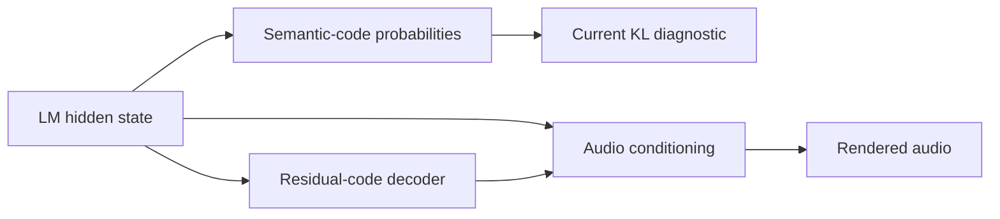

# Smoke continuation after the 600-update listening comparison

The user reports: “i think its still improving, or at least changing. they do
sound more feminine at 600 than 450”. This is evidence of stronger perceived
feminine voice character in the listened samples. It is not a confirmed overall
quality ranking, a seed-specific rating, or an optimal training length.

Later feedback confirms “900 is busted”. The initial “750 is good” was qualified
by “750 might be starting to bust a bit but it also is very feminine and cool”.
Treat 750 as an appealing strong-effect candidate with possible degradation.
The [saved-critic investigation](failure_cause_findings_20260904.md) narrows the
mechanism without claiming a proven initiating cause.

## Why KL can rise without audible breakdown

The measured quantity is KL(positive-caption teacher || neutral-caption adapter)
over legal next audio-code probabilities and EOS, on shared fixed audio
histories. It uses raw temperature-1 probabilities before CFG and top-k. It is
not a divergence between the distributions of complete rendered songs, and the
teacher is not an oracle for the most desirable degree of voice femininity.

There is a concrete architectural omission. In the installed MiniMax Music 3
encoder, `_generate_depth_codes` projects the LM's `last_hidden` directly into
the residual-code decoder. The frame conditioning also concatenates that LM
hidden state with the depth-decoder hidden states. Our evaluator measures only
the semantic-code head, and does not evaluate either residual-code policies or
the final acoustic rendering. Those additional paths can transmit audible
changes that this KL does not describe. The code establishes the paths, not
which particular pathway caused the user's perceived change.

Implementation inspected:
`/home/mikkel/anaconda3/envs/minimax-music3/lib/python3.11/site-packages/diffusers/modular_pipelines/minimax_music3/encoders.py`,
`_generate_depth_codes` and the autoregressive sampling loop. Actual sampling
also uses CFG and top-k, unlike this raw conditional KL.

The smoke objective differs from this measurement. The transformer critic
scores hidden-state changes on the lyric span plus the final prompt position.
The adapter learns through a relativistic adversarial loss and batch-mean
feature matching, with end-margin regularization. The pole MSE and lyric-hold
weights are zero; no KL loss is applied. Thus there is no objective requiring
this heldout KL to decrease at every update, or even to track perceived voice
strength. The critic also changes during training.

Relevant code:

- `train_lm_slider_music3.py`: `losses_from`, `_gather_span_last`, `matching_loss`,
  and the combined `row_loss` in the generator phase.
- `lm_adv.py`: `rp_g_loss`, `feature_matching_loss`, and `cap_penalty`.
- `scripts/train_lm_gan_bcap.sh`: the unchanged smoke settings.

The `b_cap` term softly penalizes the critic's input-gradient norm above its
threshold at sampled real and fake hidden states. It does not bound the
adapter's total weight movement, guarantee global smoothness, or enforce an
upper limit on output-policy KL.

Feature matching targets learned feature statistics rather than every output
probability. The original treatment also explains why the evolving GAN game
need not behave like minimizing one fixed supervised loss:
[Improved Techniques for Training GANs](https://proceedings.neurips.cc/paper/2016/file/8a3363abe792db2d8761d6403605aeb7-Paper.pdf),
sections 3 and 3.1. This supports the mechanism; it does not establish that this
particular run is free from overfitting or perceptual collapse.

## What the 450-to-600 evidence actually shows

| Diagnostic | 450 | 600 |
| --- | ---: | ---: |
| First audio-token teacher KL | 0.021618 | 0.021408 |
| Continuation teacher KL, neutral histories | 0.011637 | 0.012037 |
| Continuation teacher KL, positive histories | 0.009214 | 0.010007 |
| Continuation entropy, positive histories, nats | 2.467170 | 2.469489 |
| Continuation EOS probability, positive histories | 4.033e-7 | 4.559e-7 |

First-token agreement slightly improves while continuation agreement worsens.
The mean next-token entropy on these fixed histories does not collapse. That
is narrower than a test of diversity across generated songs. All evaluated
zero-scale policies exactly match the pristine model. Training logs through
600 are finite, and the user does not hear breaking in the compared clips.
These observations do not show numerical breakdown; they also do not prove
that later checkpoints preserve every musical property.

The effective LoRA weight change is measured as `(alpha/rank) * up @ down`,
using Frobenius inner products without materializing the dense matrices.
From 450 to 600 its global norm increases by 14.82%, and its cosine with the
450 update is 0.8271. The residual after fitting the best single scalar is
56.21% of the 600 update's norm. The weights therefore change in direction as
well as magnitude; this is not equivalent to turning up one global slider
multiplier. Weight geometry does not identify which changes are audible or
prove that they cause stronger feminine voice character.

The geometry implementation was checked against explicit dense multiplication,
pure scaling, and an equivalent LoRA factorization. Detailed results are in
[adapter_geometry600_20260904.json](adapter_geometry600_20260904.json).

## Continuing the same GAN game

The completed experiment resumed the complete saved 600-update state and added
300 updates, reaching 900 total. The critic, optimizers, LoRA, history and RNG
state were restored; training settings, source fingerprints and prompt hashes
match the parent. The first 600 log rows exactly match the parent history.
Inference and full-state snapshots are retained at 750 and 900. This continues the actual 600-step game,
unlike the earlier fresh repeat from the original 300-step inference adapter.

Manual samples compare 450/600/750/900 at slider +1, using the same prompt row,
lyrics, 20-second duration cap and generation seeds 7/23. The existing 450 and
600 audio is reused byte for byte. No seed retries or automated ranking are
used. All four new clips rendered successfully. One prompt and two generation
seeds remain a limited listening test. The
[side-by-side listening page](../../eval/listen/gan-bcap-steps900-20260904/index.html)
labels 900 with the training instability described below. The user subsequently
confirmed audible failure at 900 and possible early degradation alongside the
appealing strong voice at 750. These ratings come from the user, not from render
success, duration or RMS.

## A different event: late instability around 830–840

The completed run shows a sharp instability after roughly 830 updates. This
is materially different from the modest 450-to-600 heldout KL rise. The process
exited successfully and every numeric log value remained finite, but neither
fact establishes that optimization remained stable. Earlier live checks of
finite values were insufficient to detect this event.

| Training diagnostic, mean of preceding 30 updates | Through 750 | Through 810 | Through 900 |
| --- | ---: | ---: | ---: |
| Feature-matching loss | 0.413 | 0.414 | 80.508 |
| Hidden-shift alignment cosine | 0.920 | 0.930 | 0.038 |
| Hidden-shift magnitude / teacher magnitude | 0.952 | 0.968 | 6.798 |
| End-margin drift | 0.068 | 0.065 | 4.080 |
| Critic gradient on fake inputs | 0.775 | 0.671 | 0.183 |

The full generator gradient norm before value clipping spikes to about 61,441
at update 844, compared with a mean of 18.85 in updates 781–810. The effective
LoRA weight norm grows 3.04 times from 750 to 900, and their weight-space cosine
falls to 0.3304. The saved full 900 state exactly matches its inference weights;
this is not a mismatched checkpoint or a non-finite serialization artifact.
The logs' `collapse` field is an inactive bipolar diagnostic set to zero for
this UNI recipe; it must not be read as evidence against collapse.

[Training curves](training_health900_20260904.png) and
[windowed diagnostics](training_health900_20260904.json) preserve the event.
The approximate onset describes this particular run, not a universal failure
step for the recipe.

The completed policy check confirms a much larger departure at 900:

| Checkpoint | First audio-token KL | Continuation KL, positive histories | Continuation entropy, positive histories |
| --- | ---: | ---: | ---: |
| 450 | 0.021618 | 0.009214 | 2.467170 |
| 600 | 0.021408 | 0.010007 | 2.469489 |
| 750 | 0.020341 | 0.010298 | 2.466495 |
| 900 | 5.998322 | 9.203376 | 7.991667 |

Continuation KL increases roughly 894 times from 750 to 900, while predictive
entropy rises sharply. This is a diffuse, strongly changed next-token policy
on the tested histories; it is not evidence of low-entropy mode collapse.
The 750 per-position results reproduce exactly across the two new audits,
and all 32 zero-scale comparisons across those audits remain exact. This
distinguishes an intact slider-off baseline from the unstable active adapter.
The small KL rise at 600 and this large excursion should not be interpreted
as the same event. KL remains useful for detecting large policy changes even
though its minimum did not predict the user's earlier listening preference.

See [KL curves through 900](policy_comparison900_20260904.png),
[750 policy diagnostics](policy_steps750_20260904.json) and
[900 policy diagnostics](policy_steps900_20260904.json).

One plausible mechanism is visible in `SpanTransformerD`: `forward` scores
`head(out_norm(pooled))`, while `features` returns the unnormalized `pooled`
vector for feature matching. Penalizing the input gradient of the normalized
scalar score does not bound either the raw feature magnitude or its full
Jacobian. Consequently the cap can be quiet while feature matching becomes
large; that is what the late logs show. This identifies a concrete mismatch
in what is constrained, but does not prove that feature scale initiated the
instability. The logs also contain end-margin and optimizer dynamics. A
controlled ablation of feature scaling or generator step size is needed to
separate causes, while preserving the user-liked recipe as a control.

The next decision should distinguish stronger voice character from clearer
lyrics, better phrasing, musical coherence and fewer artifacts. Increasing KL
alone is not a stopping rule. Useful improvements and unwanted drift can both
increase disagreement with a reference model, so new clips decide whether to
keep extending and broader prompts/seeds are needed before fixing a default.
For this run, preserve 600/750 as listening candidates and investigate the
750–825 region or a controlled stability change before extending the unstable
900 state. This is not an automatic claim that 750 sounds best.
