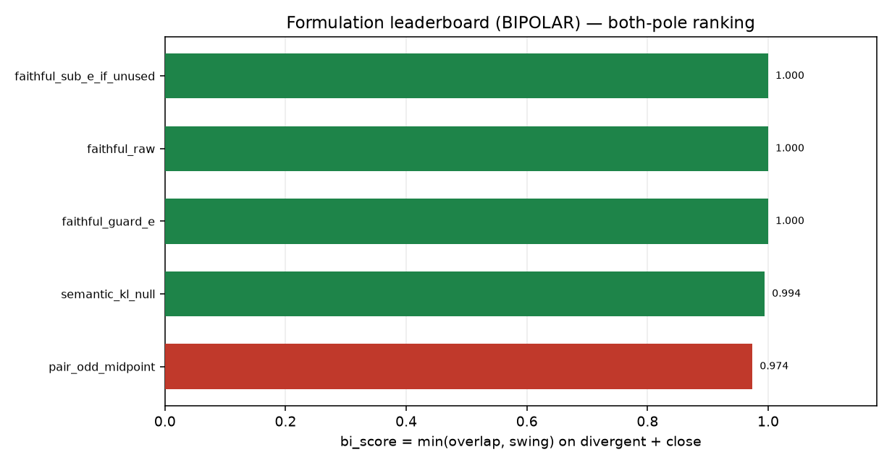

# Formulation leaderboard (BIPOLAR)

Generated by `analysis/slider2d/run_formulation_leaderboard.py --polarity bi`. CPU only, no Hub, no GPU, no Music 3 weights. Does not change the live trainer default (`--lm_target v9` / `--pole_mode hidden`). First-class sibling of [FORMULATION_LEADERBOARD_UNIPOLAR.md](FORMULATION_LEADERBOARD_UNIPOLAR.md); the compiled bipolar board lives at [lm-2d-scoreboard.md](lm-2d-scoreboard.md) and is not updated here.

## What this board asks

One residual serving a +/- pair: `delta(+1)` must sing the + pole AND `delta(-1)` must sing the - pole, on the same weights. The honesty gate per cell is the pair-exam continuation pass (overlap, position-wise agreement, off-caption, coherence, swing kept) plus leftover leak where the field has an unused axis. Eval scales are `-1, +1` — both gated.

**Antipodal `cos(+1, -1)` is logged, never gated.** Gating on it would crown the known fail: the pair-odd midpoint locks `cos(d+, a) = +1` / `cos(d+, d-) = -1` while walking off the sheet, and the caption winners that pass both exam pairs measure `collapse ~= 0`. Same for pair-odd cos, pole loss and `p%` / `n%`: logged, never scored.

## Combined rank (divergent + close)

`bi_score = min(overlap, swing)` on the two required pairs. `unused_e` is logged below, not ranked.

| rank | recipe | polarity | hits required | bi_score | hit divergent | hit close |
|---:|---|---|---|---:|---|---|
| 1 | `faithful_guard_e` | bi | **yes** | 1.000 | **HIT** | **HIT** |
| 2 | `faithful_raw` | bi | **yes** | 1.000 | **HIT** | **HIT** |
| 3 | `faithful_sub_e_if_unused` | bi | **yes** | 1.000 | **HIT** | **HIT** |
| 4 | `semantic_kl_null` | bi | **yes** | 0.994 | **HIT** | **HIT** |
| 5 | `pair_odd_midpoint` | bi | — | 0.974 | — | **HIT** |

## Per-cell board

### `divergent`

| recipe | overlap | swing_kept | off-corpus | coherence | leak_tok | antipodal *(diag)* | hit |
|---|---:|---:|---:|---:|---:|---:|---|
| `pair_odd_midpoint` | 0.984 | 0.984 | 0.016 | 1.000 | N/A | -1.000 | — |
| `faithful_raw` | 1.000 | 1.000 | 0.000 | 1.000 | N/A | +0.015 | **HIT** |
| `faithful_sub_e_if_unused` | 1.000 | 1.000 | 0.000 | 1.000 | N/A | +0.015 | **HIT** |
| `semantic_kl_null` | 1.000 | 1.000 | 0.000 | 1.000 | N/A | +0.000 | **HIT** |
| `faithful_guard_e` | 1.000 | 1.000 | 0.000 | 1.000 | N/A | +0.015 | **HIT** |

### `close`

| recipe | overlap | swing_kept | off-corpus | coherence | leak_tok | antipodal *(diag)* | hit |
|---|---:|---:|---:|---:|---:|---:|---|
| `pair_odd_midpoint` | 0.974 | 0.977 | 0.000 | 0.982 | N/A | -1.000 | **HIT** |
| `faithful_raw` | 1.000 | 1.000 | 0.000 | 0.982 | N/A | -0.080 | **HIT** |
| `faithful_sub_e_if_unused` | 1.000 | 1.000 | 0.000 | 0.982 | N/A | -0.080 | **HIT** |
| `semantic_kl_null` | 1.000 | 0.994 | 0.000 | 0.988 | N/A | -0.203 | **HIT** |
| `faithful_guard_e` | 1.000 | 1.000 | 0.000 | 0.982 | N/A | -0.080 | **HIT** |

### `unused_e`

| recipe | overlap | swing_kept | off-corpus | coherence | leak_tok | antipodal *(diag)* | hit |
|---|---:|---:|---:|---:|---:|---:|---|
| `pair_odd_midpoint` | 0.969 | 0.962 | 0.021 | 0.988 | +0.227 | -1.000 | **HIT** |
| `faithful_raw` | 1.000 | 1.000 | 0.000 | 1.000 | +0.228 | +0.015 | **HIT** |
| `faithful_sub_e_if_unused` | 0.974 | 0.995 | 0.021 | 0.982 | +0.000 | +0.098 | **HIT** |
| `semantic_kl_null` | 1.000 | 1.000 | 0.000 | 1.000 | +0.227 | -0.102 | **HIT** |
| `faithful_guard_e` | 0.974 | 0.995 | 0.021 | 0.982 | +0.000 | +0.098 | **HIT** |



## Bipolar vs unipolar: when to read which

Bipolar vs unipolar: the bipolar board asks whether one residual serves a +/- pair — delta(+1) must sing the + pole AND delta(-1) must sing the - pole, on the same weights. Read it when the fader has two ends (a signed concept axis). The unipolar board asks whether scale +1 covers the + caption without leaking off-caption and whether scale 0 holds the neutral — delta(-1) is an unscored canary there. Read it when only the + end is trained (plus-only / UNI formulations). A method can top one board and fail the other: that split is the point, not a contradiction. Antipodal cos(+1, -1) is logged on both boards and gated on neither — perfect antipodal lock coexists with walking off the sheet (#22), so the gates stay audible (continuation / cover / hold).

## Related cells (not this scale)

- [FORMULATION_LEADERBOARD_UNIPOLAR.md](FORMULATION_LEADERBOARD_UNIPOLAR.md) — the unipolar sibling.
- [lm-pair-exam.md](lm-pair-exam.md) — the pair cells this board reuses.
- [lm-2d-scoreboard.md](lm-2d-scoreboard.md) — compiled bipolar board.

## How to run

```bash
PYTHONPATH=. python analysis/slider2d/run_formulation_leaderboard.py --polarity bi --out docs/formulation-leaderboard
PYTHONPATH=. pytest tests/test_formulation_leaderboard.py -q
```

CPU only. No Hub, no GPU, no Music 3 weights. Seed `0`, `400` Adam steps.

