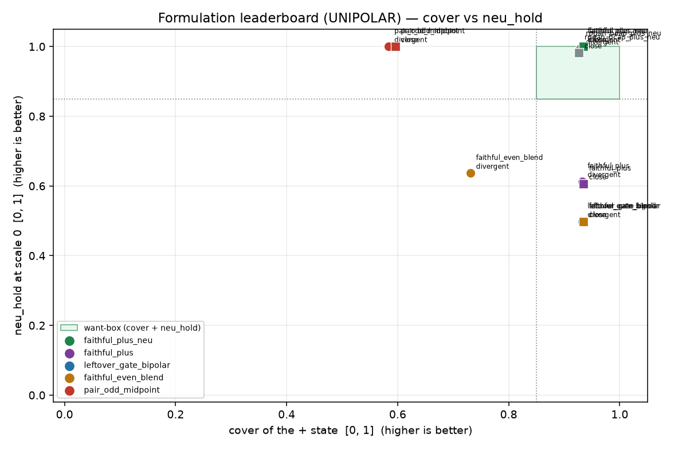

# Formulation leaderboard (UNIPOLAR)

Generated by `analysis/slider2d/run_formulation_leaderboard.py --polarity uni`. CPU only, no Hub, no GPU, no Music 3 weights. Does not change the live trainer default (`--lm_target v9` / `--pole_mode hidden`). First-class sibling of [FORMULATION_LEADERBOARD_BIPOLAR.md](FORMULATION_LEADERBOARD_BIPOLAR.md); the compiled bipolar board lives at [lm-2d-scoreboard.md](lm-2d-scoreboard.md) and is not updated here.

## What this board asks

Plus-oriented fit and eval without requiring bipolar antipodal collapse. Three honesty gates, all on the + / neutral fader:

1. **plus cover** at scale 1: `>= 0.85`.
2. **plus leak** (off-caption on the + continuation) at scale 1: `<= 0.05`.
3. **neu_hold** at scale 0: `>= 0.85`.

Eval scales are `0, 0.5, 1`. Gates read scales 0 and 1; scale 0.5 is a logged interpolation diagnostic (`half_cover`: does the halfway fader sit between neutral and + instead of jumping or collapsing). Scale `-1` is reported as an unscored canary (`dangerous` = landed on + or -1 off-caption above the 0.05 suggestion) — it is never a score. Antipodal `cos(+1, -1)` is never consulted.

## Combined rank (divergent + close)

In-box first (hit on both required pairs), then neu_hold, then cover, then off-caption. `unused_e` is logged below, not ranked.

| rank | recipe | train | polarity | in-box | neu_hold | cover | off-caption | hit divergent | hit close |
|---:|---|---|---|---|---:|---:|---:|---|---|
| 1 | `faithful_plus_neu` | plus+neu | uni | **yes** | 1.000 | 0.933 | 0.000 | **HIT** | **HIT** |
| 2 | `rpgan_bcap_plus_neu` | GAN +/0 | uni | **yes** | 0.988 | 0.928 | 0.000 | **HIT** | **HIT** |
| 3 | `pair_odd_midpoint` | bipolar ± | uni | — | 1.000 | 0.590 | 0.016 | — | — |
| 4 | `faithful_plus` | plus-only | uni | — | 0.610 | 0.933 | 0.000 | — | — |
| 5 | `faithful_even_blend` | bipolar ± | uni | — | 0.567 | 0.833 | 0.000 | — | — |
| 6 | `leftover_gate_bipolar` | bipolar ± | uni | — | 0.498 | 0.933 | 0.000 | — | — |

## Per-cell board

### `divergent`

| recipe | train | cover | off-caption | neu_hold | half_cover@0.5 *(diag)* | -1 canary *(diag)* | hit |
|---|---|---:|---:|---:|---:|---|---|
| `faithful_plus_neu` | plus+neu | 0.932 | 0.000 | 1.000 | 0.502 | neu/0.708 **danger** | **HIT** |
| `faithful_plus` | plus-only | 0.932 | 0.000 | 0.613 | 0.616 | neu/1.000 **danger** | — |
| `leftover_gate_bipolar` | bipolar ± | 0.932 | 0.000 | 0.498 | 0.504 | neg/0.000 | — |
| `faithful_even_blend` | bipolar ± | 0.731 | 0.000 | 0.637 | 0.502 | neg/0.000 | — |
| `pair_odd_midpoint` | bipolar ± | 0.584 | 0.031 | 1.000 | 0.500 | neu/0.000 | — |
| `rpgan_bcap_plus_neu` | GAN +/0 | 0.929 | 0.000 | 0.993 | 0.502 | neu/0.625 **danger** | **HIT** |

### `close`

| recipe | train | cover | off-caption | neu_hold | half_cover@0.5 *(diag)* | -1 canary *(diag)* | hit |
|---|---|---:|---:|---:|---:|---|---|
| `faithful_plus_neu` | plus+neu | 0.935 | 0.000 | 1.000 | 0.502 | neu/0.000 | **HIT** |
| `faithful_plus` | plus-only | 0.935 | 0.000 | 0.606 | 0.622 | neu/0.000 | — |
| `leftover_gate_bipolar` | bipolar ± | 0.935 | 0.000 | 0.498 | 0.504 | neg/0.000 | — |
| `faithful_even_blend` | bipolar ± | 0.935 | 0.000 | 0.498 | 0.504 | neg/0.000 | — |
| `pair_odd_midpoint` | bipolar ± | 0.596 | 0.000 | 1.000 | 0.500 | neg/0.000 | — |
| `rpgan_bcap_plus_neu` | GAN +/0 | 0.927 | 0.000 | 0.982 | 0.504 | neu/0.000 | **HIT** |

### `unused_e`

| recipe | train | cover | off-caption | neu_hold | half_cover@0.5 *(diag)* | -1 canary *(diag)* | hit |
|---|---|---:|---:|---:|---:|---|---|
| `faithful_plus_neu` | plus+neu | 0.932 | 0.000 | 1.000 | 0.502 | neu/0.625 **danger** | **HIT** |
| `faithful_plus` | plus-only | 0.697 | 0.042 | 0.619 | 0.541 | neu/0.844 **danger** | — |
| `leftover_gate_bipolar` | bipolar ± | 0.697 | 0.042 | 0.498 | 0.448 | neg/0.010 | — |
| `faithful_even_blend` | bipolar ± | 0.697 | 0.042 | 0.498 | 0.448 | neg/0.010 | — |
| `pair_odd_midpoint` | bipolar ± | 0.584 | 0.042 | 1.000 | 0.500 | neu/0.000 | — |
| `rpgan_bcap_plus_neu` | GAN +/0 | 0.928 | 0.000 | 0.986 | 0.502 | neu/0.667 **danger** | **HIT** |



## Bipolar vs unipolar: when to read which

Bipolar vs unipolar: the bipolar board asks whether one residual serves a +/- pair — delta(+1) must sing the + pole AND delta(-1) must sing the - pole, on the same weights. Read it when the fader has two ends (a signed concept axis). The unipolar board asks whether scale +1 covers the + caption without leaking off-caption and whether scale 0 holds the neutral — delta(-1) is an unscored canary there. Read it when only the + end is trained (plus-only / UNI formulations). A method can top one board and fail the other: that split is the point, not a contradiction. Antipodal cos(+1, -1) is logged on both boards and gated on neither — perfect antipodal lock coexists with walking off the sheet (#22), so the gates stay audible (continuation / cover / hold).

## Related cells (not this scale)

- [FORMULATION_LEADERBOARD_BIPOLAR.md](FORMULATION_LEADERBOARD_BIPOLAR.md) — the bipolar sibling.
- [lm-plus-neu-exam.md](lm-plus-neu-exam.md) — the plus+neu exam this board reuses.
- [lm-plus-exam.md](lm-plus-exam.md) — plus-only cover / off-caption.
- [lm-2d-scoreboard.md](lm-2d-scoreboard.md) — compiled bipolar board.

## How to run

```bash
PYTHONPATH=. python analysis/slider2d/run_formulation_leaderboard.py --polarity uni --out docs/formulation-leaderboard
PYTHONPATH=. pytest tests/test_formulation_leaderboard.py -q
```

CPU only. No Hub, no GPU, no Music 3 weights. Seed `0`, `400` Adam steps.

