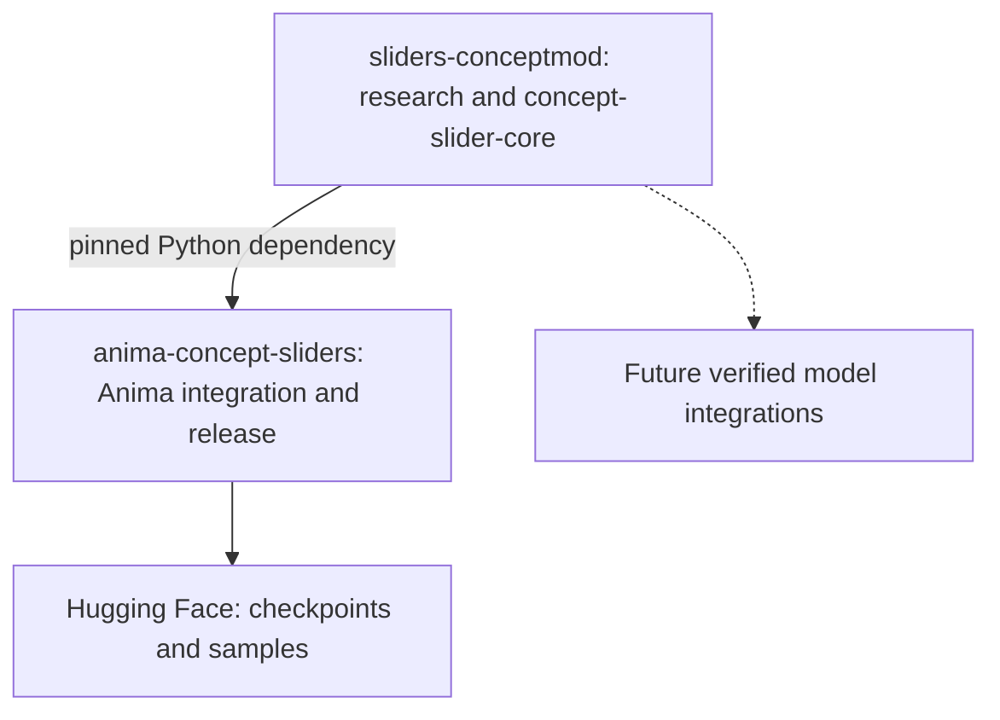

# Shared algorithms, model-specific releases

`sliders-conceptmod` is the research home and owner of the installable
[`concept-slider-core`](../packages/concept-slider-core) package. Small model
repositories depend on an immutable core revision and publish their own model
integration, recipe, evidence and samples. Hugging Face hosts their artifacts.



| Area | Shared core | Model repository |
|---|---|---|
| Particle adapter | Soft routing and bottleneck MLP | Projection names, rank, particle cloud ownership, hooks, strength controls |
| Learning | Paired losses, critic, VIC regularizer and noise function | Frozen targets, normalization policy, optimizer recipe, update loop and exact replay |
| Ordinary LoRA fitting | Dual ridge solve | Activation capture, calibration budget, up matrix, export names, evaluation |
| Evidence | Algorithm tests and extraction provenance | Weight hashes, prompts, samples, model license, runtime lock and integration tests |

The initial consumer is **Anima**. Its native runtime, trainer, ComfyUI plugin
and distiller use the shared package. The byte-identical reference extraction
preserves Anima's checkpoint fingerprint: its compatibility shim delegates to
the core and its provenance code hashes the actual core implementation file.
The release retains the original trainer and model-specific recipe.

**YuE2 and Music 3 are not migrated in this change.** Their current releases
remain reproducible through their existing source and pins. They illustrate
why model collection and evaluation stay outside the package: diffusion
velocities and autoregressive hidden states require different targets and
different held-out tests.

## Research and fitting

With particle cloud P and a projected input u, routing computes
`z = softmax(R(u) @ P.T / sqrt(particle_dim)) @ P`. The branch predicts
`up(F(concat(u, z)))`. Particle training compares paired noisy real and fake
errors through relativistic logistic losses; it regularizes the particle cloud
and critic. The model adapter defines what those errors mean.

To fit an ordinary LoRA, Anima keeps the teacher's up matrix U and solves for
the down matrix A from calibration inputs X and routed bottleneck outputs H:

```text
lambda = 0.01 * max(mean(diag(X @ X.T)), 1e-8)
A = solve(X @ X.T + lambda * I, H).T @ X
delta(x) = (x @ A.T) @ U.T
```

This minimizes a regularized calibration objective. It does not establish the
best visual or audio result. Anima fixes the ridge fraction before development
evaluation; its smaller projection error is not an image-quality score. Its
published distills show milder lighting changes than the original particles.
The complete [Anima formulation](https://github.com/mikkel/anima-concept-sliders/blob/main/FORMULATION.md)
and [distillation recipe](https://github.com/mikkel/anima-concept-sliders/blob/main/DISTILLATION.md)
define the current experiment. Existing YuE2 research remains in the root
[README](../README.md#yue2-the-lead-formulation).

## Adding an algorithm or model

1. Keep tensor-level algorithms independent of model imports and checkpoint keys.
2. Name a new recipe or API when the objective, normalization or solver changes;
   do not silently change an established release's defaults.
3. Test gradients and checkpoint-state compatibility, and compare outputs against
   the prior implementation before switching a consumer.
4. Fit on training data. Use development data for declared selection, and keep
   final-test examples out of fitting and selection. Publish perceptual samples
   alongside internal metrics.
5. Pin a full core commit in the consumer and record the algorithm file hashes.
   Publish weights and evidence under a new release if the behavior changes.

The package version identifies the API family; the Git revision and file hashes
identify the exact research implementation. Existing tagged releases remain
valid even as research continues here.
