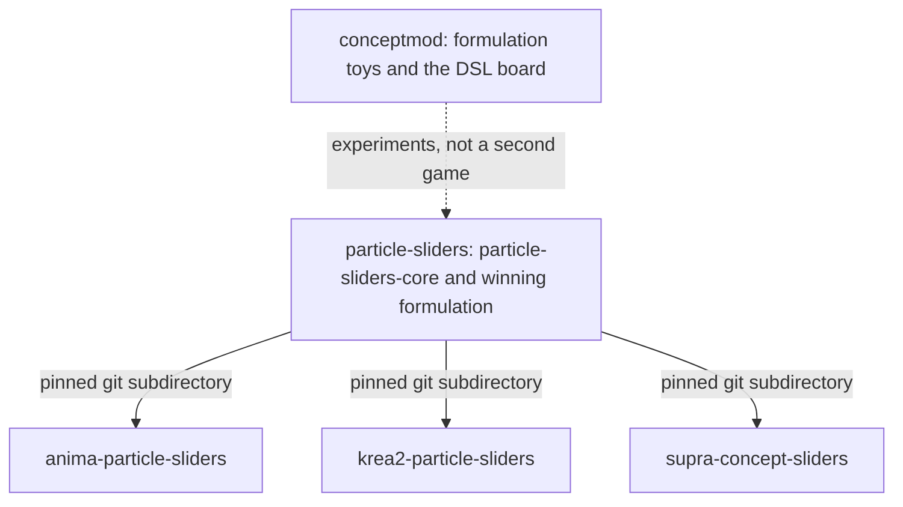

# Shared particle-sliders core

[HyperGAN/particle-sliders](https://github.com/HyperGAN/particle-sliders) owns
the installable [`particle-sliders-core`](../packages/particle-sliders-core)
package and the research trainers around it. Every product repository pins
that package and imports [`winning_formulation()`](winning-formulation.md).



| Area | This core | Product repository |
|---|---|---|
| Architecture | `gmix_architecture()` | Routed particles and a global-mix critic. Fixed product structure |
| Formulation | `winning_formulation()` | Gmix plus `CURRENT_FORMULATION`. Parameters are provisional until ParticleGAN #38 crowns a full live leaderboard winner (9 toys × 29 bounds). Call `require()`; bump the pin when the overlay changes |
| Particle adapter | Soft routing and bottleneck MLP | Projection names, hooks, strength controls |
| Learning | Paired losses, global-mix critic, VIC, noise; ParticleGAN `GradientPenalty` / `GANLoss` / `ParticleRegularizer` (alias `GradRegularizer`) | Frozen targets, optimizer step sizes on `model_surface_keys`, update loop |
| Named callables | `gmix_architecture()`, `particle_gmix_1600_v2()`, `locked_shared_recipe()` | Architecture stays gmix. `particle_gmix_1600_v2` is the provisional parameter overlay. `locked_shared` is an endpoint recipe, not the product architecture |
| Ordinary LoRA fitting | Dual ridge solve | Activation capture, calibration budget, export names |
| Evidence | Algorithm tests and the stamp pin against `V2_SPEC` | Weight hashes, prompts, samples, license, runtime lock |

Formulation toys stay in [HyperGAN/conceptmod](https://github.com/HyperGAN/conceptmod).
This package is the train and infer algorithms plus the winning stamp. It
**depends on ParticleGAN develop** (`particlegan` 0.6.0 API) as a transitive
dependency of `particle-sliders-core`. Cap (`GradientPenalty` /
`make_b_cap`), RpGAN loss (`GANLoss` / `make_gan_loss`), and particle VIC
(`ParticleRegularizer`) come from that API. `GradRegularizer` remains a
compatibility alias re-exported from `particle_sliders`. Gmix (RoutedMLP,
global-mix critic) stays here — do not replace product architecture with a
ParticleGAN recipe.

The name `concept-slider-core` / `concept_slider_core` is the legacy Anima
extraction path. New installs use `particle-sliders-core` from this GitHub
repository, not `mikkel/sliders-conceptmod`.

Krea2's current product README forbids a particle-sliders checkout and its
docs contract rejects the string `PARTICLE_SLIDERS_ROOT`. That self-contained
rule is the wrong long-term pattern. The dependency is a pinned install of
this package. A path variable is a worse install than the git subdirectory,
and omitting the dependency means the product re-implements the game.

Research trainers in this repository (YuE2, Music 3, the in-tree Supra and
image backends) are still here. This change does not delete them. Product
releases do not treat those files as a private fork of the stamp.

## Routing and the ordinary LoRA fit

With particle cloud P and a projected input u, routing computes
`z = softmax(R(u) @ P.T / sqrt(particle_dim)) @ P`. The branch predicts
`up(F(concat(u, z)))`. Particle training compares paired noisy real and fake
errors through relativistic logistic losses and regularizes the particle cloud
and the critic. The product adapter defines what those errors mean on that
backbone.

To fit an ordinary LoRA, keep the teacher's up matrix U and solve for the down
matrix A from calibration inputs X and routed bottleneck outputs H:

```text
lambda = 0.01 * max(mean(diag(X @ X.T)), 1e-8)
A = solve(X @ X.T + lambda * I, H).T @ X
delta(x) = (x @ A.T) @ U.T
```

This minimizes a regularized calibration objective. It does not establish the
best visual or audio result.

## Adding a product

1. Pin a full commit:
   `particle-sliders-core @ git+https://github.com/HyperGAN/particle-sliders.git@<commit>#subdirectory=packages/particle-sliders-core`
   (`particlegan` develop is transitive — do not vendor a second GradRegularizer).
2. Import `winning_formulation` and build the gmix bridge, critic, regularizer,
   and losses from that object. Today's parameter overlay is `particle_gmix_1600_v2`.
3. Pass model-surface overrides (learning rates, batch) through `require()`.
   Leave Hub ids, Comfy class names, prompts, and sampling in the product.
4. When this repository replaces `CURRENT_FORMULATION` after ParticleGAN #38,
   bump the pin. The gmix architecture stays. Do not copy `formulation.py` across.

The package version identifies the API family. The git revision identifies the
stamp. Existing product pins of `concept-slider-core` at `beaffeb` remain
installable from that historical commit.
