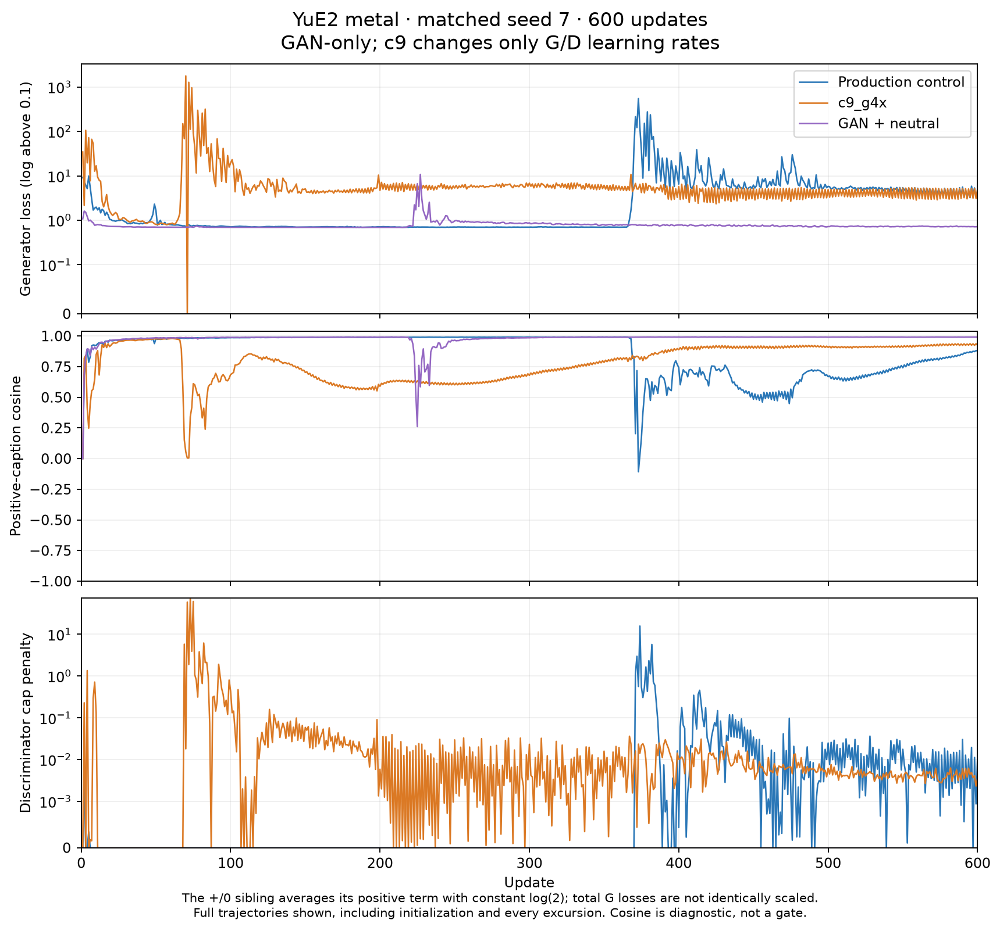

# YuE2 metal: matched c9_g4x trial

Status: complete. 106 tests passed; three native 600-step campaigns and 60 audio comparisons completed with verified artifacts. Native stability is not established.
The studio had 2 active and 58 queued jobs at preflight. The user explicitly chose to preserve that queue and share GPU 1; the studio stays running.

Existing trainers are reused. The opt-in `--propose_only_c9_g4x` changes only optimizer learning rates.
Both module-level RECIPE dictionaries, the shared GAN updates, Music ARM_B, live v9 defaults and locked AdvConfig remain unchanged.
The explicit LR flag is pinned in the resume signature; crossing control/ablation resumes fails.
There are no particles, additional G losses, schedule changes, or critic changes.

| Run | G LR | D LR | Schedule | Train seed | Updates |
|---|---:|---:|---|---:|---:|
| Production control | 0.0005 | 0.00075 | constant | 7 | 600 |
| c9_g4x (propose-only) | 0.002 | 0.003 | constant | 7 | 600 |
| Existing gan_plus_neu | 0.0005 | 0.0005 | delayed cosine, hold 80, floor 0.05 | 7 | 600 |

Four balanced shuffled train rows; two held-out rows, seeds 1709/2903, scales 0/0.5/1 plus a positive-caption reference and an **unscored -1 canary**: 20 clips per run. All captions are sound-only.

The optional held-out report measures caption-delta projection, orthogonal residual ratio, relative target error, and bitwise scale-zero identity. These are **hidden-geometry diagnostics**, not calibrated audible cover/leak or lyric-preservation gates. Toy gates remain unchanged.

## Native result: toy win did not establish native stability

All three 600-update runs and all 60 held-out clips completed from frozen source `a8a323f`.
The control and c9 have the same base model, prompt text, raw targets, shuffled row order,
seed and budget. Only optimizer learning rates differ; both use the existing production
GAN update. The sibling uses its existing +/0 game and schedule. No extra generator
loss, particles, sampling, critic switch, normalization or default promotion was added.

| Run | Final total G | Peak total G (step) | Lowest cosine after step 10 (step) | Final cosine | +1 held-out relative error | GPU1 wall hours |
|---|---:|---:|---:|---:|---:|---:|
| Production control | 4.302892 | 549.757 (373) | -0.107 (373) | 0.878638 | 0.508–0.539 | 0.409 |
| c9_g4x | 5.031345 | 1784.166 (70) | 0.005 (71) | 0.925665 | 0.460–0.508 | 0.407 |
| gan_plus_neu | 0.719051 | 10.809 (227) | 0.261 (225) | 0.991566 | 0.136–0.176 | 0.415 |

The sibling's total G is the mean of its positive term and constant log(2) zero term.
Its positive-term peak is **20.925473** (total peak **10.809310**). The complete traces
include initialization and every excursion; the after-step-10 statistic is labeled,
not a cropped acceptance gate. The discriminator cap activated in the two plus-only
runs and remained zero in the sibling. No new instability guard or mid-run change was used.



The 4x trial improves the final held-out geometry only modestly while producing a much
larger, earlier loss spike. It is **not a clear native win** and is not promoted. The
+/0 sibling has the closest final hidden-state fit and a smaller excursion, but native
stability is still unresolved. These are one training seed's results, not a multi-seed
native stability finding. No audible concept or lyric-preservation gate is claimed.

### Held-out diagnostics and audio levels

Projection 1 means the full positive-caption direction is reached; orthogonal ratio
measures the off-direction residual relative to that caption delta. Relative target
error is `norm(student-positive)/norm(positive-neutral)`. These are unscored hidden-state
measurements, **not** the toy continuation cover/off-caption metrics. At scale 0 all
held-out states equal the base bit-for-bit. The -1 canary remains unscored.

| Run | +1 caption projection | +1 orthogonal ratio | Full/off audio RMS ratio (4 matched pairs) |
|---|---:|---:|---:|
| Production control | 1.013–1.036 | 0.508–0.538 | 0.106–0.362 |
| c9_g4x | 1.005–1.034 | 0.460–0.507 | 0.182–0.337 |
| gan_plus_neu | 0.959–1.007 | 0.136–0.171 | 0.493–1.020 |

All 60 audio files are finite, non-silent stereo 48 kHz, approximately 20 seconds.
They retain the native output level. RMS is an attenuation diagnostic, not an audible
quality score. Off and positive-caption references are byte-identical across all three
runs. Native artifact manifests, audio hashes, exported adapter tensors, source hashes,
raw positive targets, optimizer steps and exact resume histories were verified. All
100-step milestones plus the 2-step preflights remain available. The 20-second token
cap is reported as semantic truncation; these are comparisons, not full-song completions.

Listening root: `eval/listen/yue2-metal-c9-20260916/`, with `control/`, `c9-g4x/`,
and `plus-neu/`. The existing `yue2-metal-arm-b-600-20260916/` bookmark points to that
comparison page. Its curves update every second during execution. Previous trials
remain linked and preserved. Each run's listening page includes its weight download.

Total **1.230 GPU1 run wall hours**, shared with the studio. This includes model loading, training, rendering and checkpoint I/O, plus the short preflights; it is not exclusive GPU utilization time. The studio and its queued jobs were preserved.

What transferred: the exact GAN equations, raw-positive teacher, no-particle posture,
zero-by-adapter contract, and c9's CPU unipolar HIT. What did not transfer: the toy's
600-step stability/benefit from 4x rates. The toy uses a direct residual, while native
training uses factorized adapters through a frozen transformer; their learning-rate
units and trajectories are not equivalent. This experiment does not isolate the
cause of the native excursions. Nothing here changes Music ARM_B, live v9,
locked_shared, or AdvConfig defaults.

Compact native results and hashes: [yue2-c9-native-results.json](yue2-c9-native-results.json).
Full local logs, per-update history, render checks and commands are retained under
`analysis/yue2_metal_c9_20260916/` and the model/listening directories below.

| Run | Weights SHA-256 |
|---|---|
| Production control | `003fb6f02ff948f25a650c4371042b7094e5ba350537a558afe9f81149b3ea5e` |
| c9_g4x | `d2264d6fd092aa8941f507cc23b019232934e186983485502753b95a9c48297e` |
| gan_plus_neu | `4ac471b0ea65b7ac3198607625d3e43a263bff5cf32c86ec6bb28cfc03e3585e` |

## Full executed commands (printed before GPU spend)

Runtime: the existing isolated YuE2 Python; no installation. Physical GPU 1 maps to `--device cuda:0`.
Each two-step preflight retains a 600-step schedule horizon and resumes into its own campaign.

```bash
export CUDA_VISIBLE_DEVICES=1
export HF_HOME=/ml2/music/.cache/huggingface
export HF_HUB_OFFLINE=1
export OMP_NUM_THREADS=4
export MKL_NUM_THREADS=4
export PYTORCH_CUDA_ALLOC_CONF=expandable_segments:True
export PYTHONPATH=/ml2/music/.cache/sliders-yue2-c9-native-20260916
unset TRANSFORMERS_CACHE
```

### control

```bash
/ml2/music/.cache/yue2-test-env/bin/python -u /ml2/music/.cache/sliders-yue2-c9-native-20260916/conceptmod/textsliders/train_lora_yue2_arm_b.py --recipe unipolar_gan --save_dir /ml2/music/sliders-conceptmod/models/metal-yue2-uni-control-600-s7-20260916 --name metal-yue2-uni-control-600-s7-20260916 --steps 600 --seed 7 --device cuda:0 --prompts_file /ml2/music/.cache/sliders-yue2-c9-native-20260916/conceptmod/textsliders/data/prompts-yue2-metal-arm-b.yaml --until 2
/ml2/music/.cache/yue2-test-env/bin/python -u /ml2/music/.cache/sliders-yue2-c9-native-20260916/scripts/train_yue2_arm_b_campaign.py --recipe unipolar_gan --save_dir /ml2/music/sliders-conceptmod/models/metal-yue2-uni-control-600-s7-20260916 --output_dir /ml2/music/sliders-conceptmod/eval/listen/yue2-metal-c9-20260916/control --name metal-yue2-uni-control-600-s7-20260916 --steps 600 --seed 7 --gpu 1 --prompts_file /ml2/music/.cache/sliders-yue2-c9-native-20260916/conceptmod/textsliders/data/prompts-yue2-metal-arm-b.yaml --eval_prompts_file /ml2/music/.cache/sliders-yue2-c9-native-20260916/conceptmod/textsliders/data/prompts-yue2-metal-arm-b-eval.yaml --include_canary --hidden_diagnostics
```

Expanded campaign children:

```bash
/ml2/music/.cache/yue2-test-env/bin/python -u /ml2/music/.cache/sliders-yue2-c9-native-20260916/conceptmod/textsliders/train_lora_yue2_arm_b.py --recipe unipolar_gan --save_dir /ml2/music/sliders-conceptmod/models/metal-yue2-uni-control-600-s7-20260916 --name metal-yue2-uni-control-600-s7-20260916 --steps 600 --seed 7 --device cuda:0 --prompts_file /ml2/music/.cache/sliders-yue2-c9-native-20260916/conceptmod/textsliders/data/prompts-yue2-metal-arm-b.yaml
/ml2/music/.cache/yue2-test-env/bin/python -u /ml2/music/.cache/sliders-yue2-c9-native-20260916/scripts/evaluate_yue2_arm_b.py --recipe unipolar_gan --weights /ml2/music/sliders-conceptmod/models/metal-yue2-uni-control-600-s7-20260916/metal-yue2-uni-control-600-s7-20260916_last.safetensors --prompts_file /ml2/music/.cache/sliders-yue2-c9-native-20260916/conceptmod/textsliders/data/prompts-yue2-metal-arm-b-eval.yaml --output_dir /ml2/music/sliders-conceptmod/eval/listen/yue2-metal-c9-20260916/control --include_canary --hidden_diagnostics
```

### c9-g4x

```bash
/ml2/music/.cache/yue2-test-env/bin/python -u /ml2/music/.cache/sliders-yue2-c9-native-20260916/conceptmod/textsliders/train_lora_yue2_arm_b.py --recipe unipolar_gan --save_dir /ml2/music/sliders-conceptmod/models/metal-yue2-uni-c9-g4x-600-s7-20260916 --name metal-yue2-uni-c9-g4x-600-s7-20260916 --steps 600 --seed 7 --device cuda:0 --prompts_file /ml2/music/.cache/sliders-yue2-c9-native-20260916/conceptmod/textsliders/data/prompts-yue2-metal-arm-b.yaml --propose_only_c9_g4x --until 2
/ml2/music/.cache/yue2-test-env/bin/python -u /ml2/music/.cache/sliders-yue2-c9-native-20260916/scripts/train_yue2_arm_b_campaign.py --recipe unipolar_gan --save_dir /ml2/music/sliders-conceptmod/models/metal-yue2-uni-c9-g4x-600-s7-20260916 --output_dir /ml2/music/sliders-conceptmod/eval/listen/yue2-metal-c9-20260916/c9-g4x --name metal-yue2-uni-c9-g4x-600-s7-20260916 --steps 600 --seed 7 --gpu 1 --prompts_file /ml2/music/.cache/sliders-yue2-c9-native-20260916/conceptmod/textsliders/data/prompts-yue2-metal-arm-b.yaml --eval_prompts_file /ml2/music/.cache/sliders-yue2-c9-native-20260916/conceptmod/textsliders/data/prompts-yue2-metal-arm-b-eval.yaml --include_canary --hidden_diagnostics --propose_only_c9_g4x
```

Expanded campaign children:

```bash
/ml2/music/.cache/yue2-test-env/bin/python -u /ml2/music/.cache/sliders-yue2-c9-native-20260916/conceptmod/textsliders/train_lora_yue2_arm_b.py --recipe unipolar_gan --save_dir /ml2/music/sliders-conceptmod/models/metal-yue2-uni-c9-g4x-600-s7-20260916 --name metal-yue2-uni-c9-g4x-600-s7-20260916 --steps 600 --seed 7 --device cuda:0 --prompts_file /ml2/music/.cache/sliders-yue2-c9-native-20260916/conceptmod/textsliders/data/prompts-yue2-metal-arm-b.yaml --propose_only_c9_g4x
/ml2/music/.cache/yue2-test-env/bin/python -u /ml2/music/.cache/sliders-yue2-c9-native-20260916/scripts/evaluate_yue2_arm_b.py --recipe unipolar_gan --weights /ml2/music/sliders-conceptmod/models/metal-yue2-uni-c9-g4x-600-s7-20260916/metal-yue2-uni-c9-g4x-600-s7-20260916_last.safetensors --prompts_file /ml2/music/.cache/sliders-yue2-c9-native-20260916/conceptmod/textsliders/data/prompts-yue2-metal-arm-b-eval.yaml --output_dir /ml2/music/sliders-conceptmod/eval/listen/yue2-metal-c9-20260916/c9-g4x --include_canary --hidden_diagnostics
```

### plus-neu

```bash
/ml2/music/.cache/yue2-test-env/bin/python -u /ml2/music/.cache/sliders-yue2-c9-native-20260916/conceptmod/textsliders/train_lora_yue2_arm_b.py --recipe gan_plus_neu --save_dir /ml2/music/sliders-conceptmod/models/metal-yue2-plus-neu-600-s7-20260916-r2 --name metal-yue2-plus-neu-600-s7-20260916-r2 --steps 600 --seed 7 --device cuda:0 --prompts_file /ml2/music/.cache/sliders-yue2-c9-native-20260916/conceptmod/textsliders/data/prompts-yue2-metal-arm-b.yaml --until 2
/ml2/music/.cache/yue2-test-env/bin/python -u /ml2/music/.cache/sliders-yue2-c9-native-20260916/scripts/train_yue2_arm_b_campaign.py --recipe gan_plus_neu --save_dir /ml2/music/sliders-conceptmod/models/metal-yue2-plus-neu-600-s7-20260916-r2 --output_dir /ml2/music/sliders-conceptmod/eval/listen/yue2-metal-c9-20260916/plus-neu --name metal-yue2-plus-neu-600-s7-20260916-r2 --steps 600 --seed 7 --gpu 1 --prompts_file /ml2/music/.cache/sliders-yue2-c9-native-20260916/conceptmod/textsliders/data/prompts-yue2-metal-arm-b.yaml --eval_prompts_file /ml2/music/.cache/sliders-yue2-c9-native-20260916/conceptmod/textsliders/data/prompts-yue2-metal-arm-b-eval.yaml --include_canary --hidden_diagnostics
```

Expanded campaign children:

```bash
/ml2/music/.cache/yue2-test-env/bin/python -u /ml2/music/.cache/sliders-yue2-c9-native-20260916/conceptmod/textsliders/train_lora_yue2_arm_b.py --recipe gan_plus_neu --save_dir /ml2/music/sliders-conceptmod/models/metal-yue2-plus-neu-600-s7-20260916-r2 --name metal-yue2-plus-neu-600-s7-20260916-r2 --steps 600 --seed 7 --device cuda:0 --prompts_file /ml2/music/.cache/sliders-yue2-c9-native-20260916/conceptmod/textsliders/data/prompts-yue2-metal-arm-b.yaml
/ml2/music/.cache/yue2-test-env/bin/python -u /ml2/music/.cache/sliders-yue2-c9-native-20260916/scripts/evaluate_yue2_arm_b.py --recipe gan_plus_neu --weights /ml2/music/sliders-conceptmod/models/metal-yue2-plus-neu-600-s7-20260916-r2/metal-yue2-plus-neu-600-s7-20260916-r2_last.safetensors --prompts_file /ml2/music/.cache/sliders-yue2-c9-native-20260916/conceptmod/textsliders/data/prompts-yue2-metal-arm-b-eval.yaml --output_dir /ml2/music/sliders-conceptmod/eval/listen/yue2-metal-c9-20260916/plus-neu --include_canary --hidden_diagnostics
```

## Verification

106 selected tests passed, including independent RpGAN/cap equation parity, eager/checkpointed native gradients, exact c9 resume, forbidden-G-companion rejection, the actual c9 flag on both unipolar cells at 600 for seeds 0/1/7, and Music/default locks. No MSE call is allowed in the c9 acceptance fits.

The CPU schedule audit reran both `c0_production` and `c9_g4x` at 600/1200/3400 on seeds 0/1/7. It exited 1 as expected because the control fails requested early budgets. The ablation passes every requested budget/cell/seed. Compact evidence and unchanged-source hashes: [yue2-c9-native-toy-proof.json](yue2-c9-native-toy-proof.json).

| Arm | Budget | Divergent cover range | Close cover range | Off-caption | Neutral hold | Both cells, all seeds |
|---|---:|---:|---:|---:|---:|---|
| c0_production | 600 | 0.4823–0.4836 | 0.5855–0.5866 | 0.0833 max | 1.0000 min | FAIL |
| c0_production | 1200 | 0.6584–0.6606 | 0.9313–0.9325 | 0.0000 max | 1.0000 min | FAIL |
| c0_production | 3400 | 0.9312–0.9314 | 0.9337–0.9342 | 0.0000 max | 1.0000 min | PASS |
| c9_g4x | 600 | 0.9252–0.9274 | 0.9285–0.9309 | 0.0000 max | 1.0000 min | PASS |
| c9_g4x | 1200 | 0.9311–0.9316 | 0.9336–0.9345 | 0.0000 max | 1.0000 min | PASS |
| c9_g4x | 3400 | 0.9312–0.9318 | 0.9335–0.9338 | 0.0000 max | 1.0000 min | PASS |

The formulation leaderboard also reran with `--polarity both`; the existing `rpgan_bcap_plus_neu` row remains an in-box UNI HIT and fails the bipolar continuation exam. No UNI decision uses that bipolar failure or the -1 canary. The schedule ablation is assessed separately by the existing UniPG-C runner and the native-flag acceptance test; it is not silently added to or promoted by the formulation board.

Native results are recorded above; no production default was promoted.
