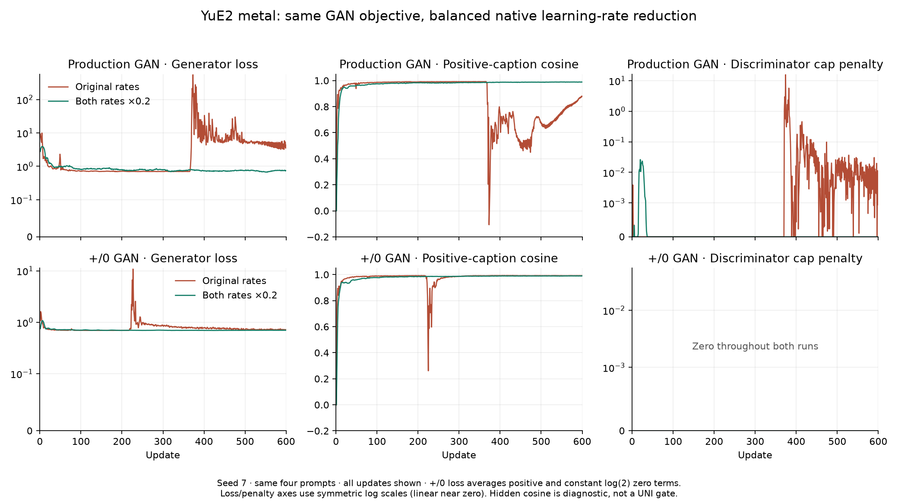

# YuE2 GAN stability audit

Both existing GAN recipes completed fresh 600-step native runs without the
previous late collapse, using the balanced rate correction.
`--propose_only_lr_scale .2` retains the existing paired RpGAN and `b_cap`,
while reducing both optimizer rates fivefold. No extra generator loss,
particle branch, sampling, critic change, or default flip is added.

## Findings

The paired logistic signs, real/fake pairing, detached D inputs, frozen D
during G backward, and exact-autograd cap match the vendored ParticleGAN
implementation. The complete-update equation tests pass. Native adapters and
optimizer state use float32; the frozen YuE2 base uses bfloat16. Ordinary and
checkpointed native forwards were bitwise identical in both audited replay
windows. No incorrect loss sign or checkpoint-forward discrepancy was found.

The main transfer risk is **native update size**. ParticleGAN's
[100-Gaussians example](https://github.com/255BITS/ParticleGAN/blob/af1843a8a7a5e4387dad8b57430b6c222042cb8b/examples/100gaussians.py)
optimizes a small generator in a different coordinate system. A native LoRA
parameter step propagates through the whole frozen transformer. `b_cap`
penalizes D's gradient with respect to hidden coordinates; it does not bound
the resulting Adam step or G's hidden-state movement. Copying loss equations
and numeric learning rates does not copy that optimization geometry.

The production control's cap stayed zero while G loss rose from about 0.7 to
41.6 at update 370. The +/0 control's cap was zero for all 600 updates despite
its spike. In an instrumented replay from control checkpoint 300, critic
slopes were about 0.06 before instability, below the cap. Its peak G loss was
666.99 at 371, with fake calibrated length 201.53 versus teacher 45.22. That
replay reproduces failure, not the original CUDA trajectory bit for bit.
The separate +/0 replay did not reproduce its spike within steps 201–245.

ParticleGAN's own
[findings](https://github.com/255BITS/ParticleGAN/blob/af1843a8a7a5e4387dad8b57430b6c222042cb8b/FINDINGS.md)
explain that the one-sided cap has no curvature below its threshold. That is
a relevant limitation, but replacing it alone did not fix native YuE2.

## Controlled comparisons

All four rate replays restore the **same** production step-300 adapter,
critic, optimizer states, row sampler, and RNG. They use the original loss,
cap, calibration, and seed 7. The window is 301–500. Failed experiments stop
when loss exceeds 10 or cosine falls below 0.8; these are diagnostic stop
conditions, not new toy or audio acceptance gates.

| Change | G LR | D LR | Window result |
|---|---:|---:|---|
| None | 5e-4 | 7.5e-4 | Failed at 371, G 26.86 |
| G / 5 | 1e-4 | 7.5e-4 | Finished; peak G 0.875, minimum cosine 0.990 |
| **G / 5, D / 5** | **1e-4** | **1.5e-4** | **Finished; peak G 0.701, minimum cosine 0.989** |
| G / 10 | 5e-5 | 7.5e-4 | Failed at 312, G 13.54 |

This supports reducing the **balanced** native step sizes, retaining D = 1.5×G,
rather than assuming an arbitrarily slow generator must be stable. Fresh
training is checked separately: restarting from an already fitted checkpoint
alone does not prove a good initialization-to-endpoint trajectory.

Two earlier one-change trials were rejected and reverted:

| Candidate | Native result |
|---|---|
| Fixed vector RMS instead of component RMS | Peak G 12.19, cosine reached -0.034; stopped at 285 |
| Symmetric R1+R2 instead of `b_cap` | Peak G 51.50, cosine reached 0.379; stopped at 140 |

Both passed their CPU toy checks. Neither was accepted on that basis. Their
immutable sources (`c1b3115`, `a01344e`) and checkpoints remain available;
neither option is present in the final trainer. Smaller numeric losses did
not count as a fix when the hidden fit collapsed.

## Implementation

The explicit flag scales both rates in a copied run recipe. It retains the
production ratio 1.5, or the existing +/0 ratio 1, and preserves each schedule.
It also updates `initial_lr`: the +/0 scheduler reads that field every update,
so changing only the current optimizer LR would silently undo the override.

Both entry points accept `--propose_only_lr_scale .2`. The source and effective
recipe are pinned in checkpoints; a different rate choice rejects resume.
`propose_only=true` and `merge_to_trainer=false` are recorded. Neither recipe
dictionary, Music bipolar Arm B, live `--lm_target v9`, nor `AdvConfig()`'s
locked shape is changed. The G objective and `b_cap` implementation are
byte-identical to the earlier production baseline.

Fresh campaigns use source `e0bca28`, seed 7, the same four sound-only metal
prompts, 600 updates, and shared GPU 1 without stopping the studio:

| Existing recipe | G LR | D LR | Schedule |
|---|---:|---:|---|
| `unipolar_gan` | 1e-4 | 1.5e-4 | constant |
| `gan_plus_neu` | 1e-4 | 1e-4 | existing delayed cosine, delay 80, floor 0.05 |

```bash
python scripts/train_yue2_arm_b_campaign.py --recipe unipolar_gan \
  --propose_only_lr_scale .2 --steps 600 --seed 7 --gpu 1 \
  --save_dir models/metal-yue2-uni-native-lr-600-s7-20260916 \
  --name metal-yue2-uni-native-lr-600-s7-20260916 \
  --output_dir eval/listen/yue2-metal-stability-20260916/native-lr-uni \
  --include_canary --hidden_diagnostics
# Repeat with --recipe gan_plus_neu and separate name/save/output paths.
```

Full argv is in `analysis/yue2_native_lr_20260916/planned-commands.json`.
Each held-out grid is two prompts × seeds 1709/2903 × 0/0.5/1,
positive-caption reference, and -1 canary. Hidden projection, orthogonal error
and relative target error are diagnostics, not calibrated audio
cover/leak/lyric gates. Negative-scale behavior is never a UNI pass/fail gate.

## CPU verification

120 regression tests pass, including actual schedule behavior at updates
1/81/300/600, exact resume of both recipes, invalid overrides, unchanged
losses, and locked bipolar defaults. The canonical leaderboard was rerun
with `--polarity both`; its unmodified +/0 GAN passes UNI and fails BI.

The slow-rate CPU audit is separate. Applying smaller numeric steps to a
direct residual also slows it: production's literal scaled rates fail the
short budgets and require 17000 updates in this audit. The +/0 toy retains
its explicitly different direct-residual base LR (5e-3), scaled by .2, and
passes both required cells at 2400 on seeds 0/1/7. The production
17000-update audit also passes both cells on all three seeds. These are not
claims of a faster toy recipe or 600-step toy acceptance. Native evidence
determines this transfer.

```bash
CUDA_VISIBLE_DEVICES='' OMP_NUM_THREADS=1 MKL_NUM_THREADS=1 PYTHONPATH=. \
  python -m pytest tests/test_yue2_native_lr.py tests/test_yue2_arm_b.py \
  tests/test_unipolar_gan.py tests/test_formulation_leaderboard.py \
  tests/test_lm_plus_neu_exam.py tests/test_music_arm_b.py \
  tests/test_music_arm_b_gates.py tests/test_yue2_c9_native.py \
  tests/test_yue2_gan_exam.py tests/test_yue2_unipg_c.py \
  tests/test_lm_2d_adv.py::test_advconfig_defaults_match_locked_baseline_shape -q
CUDA_VISIBLE_DEVICES='' OMP_NUM_THREADS=1 MKL_NUM_THREADS=1 PYTHONPATH=. \
  python analysis/slider2d/run_formulation_leaderboard.py \
  --polarity both --out /tmp/yue2-stability-boards
```

Reproduce the production slow-rate audit (CPU only):

```bash
CUDA_VISIBLE_DEVICES='' OMP_NUM_THREADS=1 MKL_NUM_THREADS=1 PYTHONPATH=. \
  python -m analysis.slider2d.yue2_gan_exam --propose_only_lr_scale .2 \
  --steps 17000 --seeds 0 1 7 --out /tmp/yue2-native-lr-toys.json
```

## Native results

Both fresh campaigns completed **600 updates at seed 7** and all 40 held-out
clips. Final checkpoint/export tensors are finite and match, both optimizer
states reach update 600, and the effective rates follow their recorded
schedules. Prompt rows, frozen targets, base identity, and shuffled row order
match the previous controls. Scale zero is exactly the base in both hidden
probes; all eight zero/reference clips per campaign are byte-identical to
the earlier controls.

| Recipe | Rates | Peak G, all updates | Minimum cosine, updates 101–600 | Final cosine | Held-out target relative errors |
|---|---|---:|---:|---:|---|
| uni | original | 549.7572 | -0.1071 | 0.8786 | 0.5394 / 0.5083 |
| uni | 20% LR | 3.9029 | 0.9739 | 0.9886 | 0.1961 / 0.1837 |
| plus-neu | original | 10.8093 | 0.2611 | 0.9916 | 0.1362 / 0.1756 |
| plus-neu | 20% LR | 1.0747 | 0.9758 | 0.9902 | 0.1664 / 0.1710 |

Production improves both held-out target errors. The +/0 result is mixed:
one error rises slightly and the other falls slightly. Stability therefore
does not imply that every held-out fit measure improves.



The two fresh campaigns used **0.8588 shared GPU wall-hours**, including
model loading and 40 audio renders. The four matched rate replays separately
used 0.1566 hours. Rejected trials and exploratory probes are additional;
this is not an all-inclusive GPU utilization measurement.

[Live comparison and listening grids](http://100.90.104.57:8888/yue2-metal-arm-b-600-20260916/).
Full tensor/audio verification: `analysis/yue2_native_lr_20260916/verified-results.json`.
Committed numerical evidence: [audit JSON](yue2-gan-stability-audit.json).

**Scope:** the reduced rates avoided the observed collapse in these two
600-step native runs. This does not establish stability on other training
seeds, prompts, or longer budgets. Hidden diagnostics are not audio cover,
leak, or lyric-hold scores; no automated audio gate or subjective listening
acceptance is claimed. The setting remains explicitly opt-in. CPU success
transferred neither a universal learning rate nor a guarantee of native
stability: both rejected changes passed toys and still failed natively.

## Are later updates still useful?

Saved checkpoints were evaluated on the same two held-out prompts, without
training or audio sampling. The metric is target relative error at +1:
lower means closer to the positive-caption hidden state. Scale zero stays
exact at every checkpoint. Re-evaluated step-600 records exactly match the
campaign's original hidden probes.

| Recipe / held-out prompt | 100 | 200 | 300 | 400 | 500 | 600 |
|---|---:|---:|---:|---:|---:|---:|
| Production / prompt 1 | 0.2535 | 0.2056 | 0.1797 | 0.1723 | 0.1719 | 0.1961 |
| Production / prompt 2 | 0.2371 | 0.1943 | 0.2161 | 0.1819 | 0.1710 | 0.1837 |
| +/0 / prompt 1 | 0.2492 | 0.1854 | 0.1784 | 0.1556 | 0.1626 | 0.1664 |
| +/0 / prompt 2 | 0.2420 | 0.1844 | 0.1734 | 0.1822 | 0.1813 | 0.1710 |

Production has its lowest mean held-out error among these checkpoints at
step 500 (0.1715), then worsens at 600 (0.1899), despite increasing
training cosine. The +/0 mean is almost unchanged from 400 (0.1689) to
600 (0.1687). Later updates therefore do not establish continued useful
learning. Step 500 is a production candidate by this diagnostic, not an
audio-quality winner or a new automatic selection gate.

The checkpoint probe used 0.0084 additional shared GPU
wall-hours. Results beyond 600 steps remain unmeasured. More updates refine
the same four training prompt targets; they do not add new examples.
